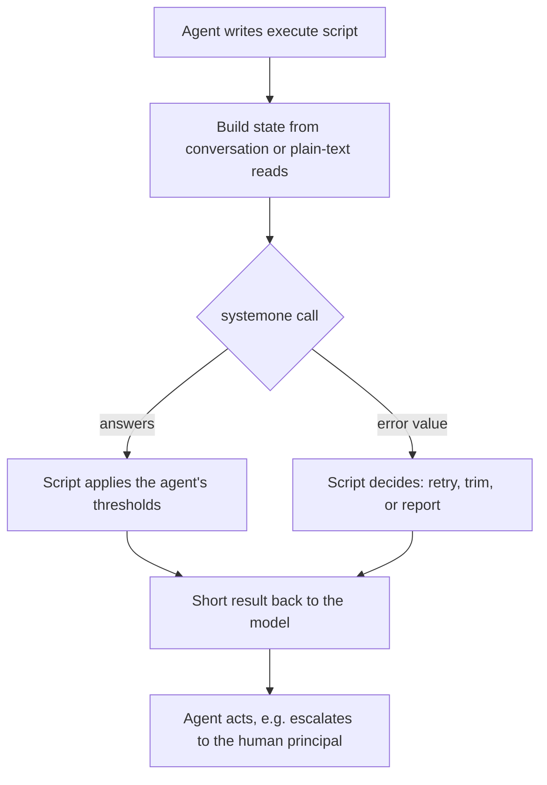
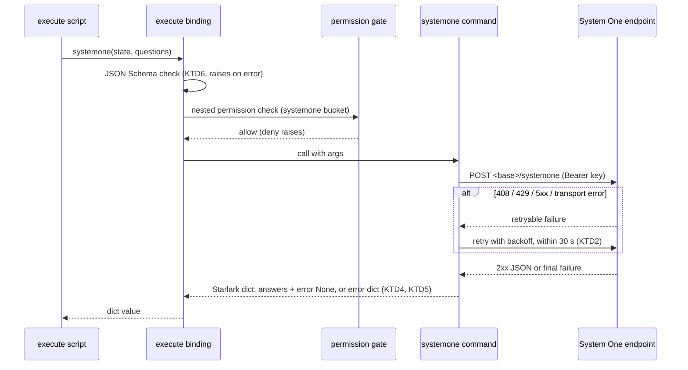

# System One Execute Command - Plan

## Goal Capsule

- **Objective:** Agents that are allowed to can answer quick classification questions (yes/no, pick one, rate on a scale) in a fraction of a second, instead of spending a slower subagent delegation on them.
- **Means:** a `systemone` command inside `execute`, implemented as an execute-only rocketcode built-in that calls TypeSafe's System One API over plain HTTP (KTD1, KTD3).
- **Product authority:** the Product Contract below; the Planning Contract wins on implementation mechanism within it. RocketClaw's own decisions (permission reviewer, guardrails, background show-the-human, skill suggestion) are not active scope.
- **Stop conditions:** stop and report if the `internal/rocketcode` source would cross its CLOC budget (10500), if TypeSafe's wire format differs from the documented shape in a way R2 or R5 cannot absorb, or if any settled Key Decision proves unworkable.
- **Execution profile:** five units, test-first where behavior is new (U1, U2, U3); docs last (U5).
- **Finishing:** implemented, reviewed and shipped as one pull request through the autonomous pipeline.
- **Open blockers:** none.

---

## Product Contract

Product Contract preservation: changed: R11, AE3, AE7 — planning found that agents without a grant never see an execute command (existing visibility rule), so R11 and AE3 now describe absence instead of a denial message; AE7 now says the plain read refuses `.env` by stopping the script, since plain output cannot carry an error message. Outstanding Questions resolved in place by KTD1–KTD9. Everything else unchanged.

### Summary

Add a `systemone(state=..., questions=...)` command to `execute`, next to `read` and `grep`. It sends TypeSafe's request format to the operator-configured endpoint and returns the answers as Starlark values for the script to use. Agents granted access can make decisions like "does this CS operation need a human?" in about 100 ms, without delegating to a subagent.

### Problem Frame

When an agent needs a small typed judgment today, it delegates to a subagent with `task`. An example is whether an operation in the customer-support queue must escalate to a human principal. The subagent runs a full LLM loop, which costs seconds and tokens for an answer that is one of a few known options.

System One models answer exactly this shape: context plus typed questions in, probabilities out. TypeSafe's Jev answers in about 100 ms and charges $0.042 per million input tokens, with no charge for output. Its weak spots are prompt injection, numbers, very literal reading and broad questions. They are known and accepted for this work.

### Actors

- A1. Agent: a root agent, task subagent or workflow worker that has been granted access and writes `execute` scripts.
- A2. Operator: configures `rocketclaw.json` and grants agents access in their frontmatter.
- A3. Human principal: affected by the decisions agents make, for example CS-queue escalations.
- A4. System One endpoint: TypeSafe, or a host that serves the same format.

### Key Decisions

- **TypeSafe's wire format is the standard.** (session-settled: user-directed — chosen over a vendor-neutral or OpenAI-shaped layer: TypeSafe is treated as the dominant standard, and OpenAI's Decisions API has no public schema.) Governs R2, R5.
- **A command inside `execute`, not a top-level tool.** (session-settled: user-directed — chosen over a model-facing function tool: execute's Starlark makes the call flexible, with caller-chosen question names, structured criteria, fan-out and code-owned thresholds.) Governs R1, R2.
- **Native internal support.** (session-settled: user-directed — chosen over MCP servers, reusing `webfetch`/`bash`/`curl`, or a vendor SDK: the user wants first-class support.) Governs R1.
- **Jev's weak spots are an accepted risk.** (session-settled: user-directed — chosen over treating injection, numbers and literal reading as blockers: guidance may reduce them, but nothing waits on them.) Governs R6.
- **A rocketcode built-in, callable only inside `execute`.** (session-settled: user-approved — chosen over a RocketClaw custom tool: workflow workers and task subagents get it, and file access goes through `read`'s permission rules.) Governs R1, R11.
- **TypeSafe's request is passed through as documented.** (session-settled: user-approved — chosen over a simplified or flattened question shape: agents can follow TypeSafe's docs, and answer quality depends on question writing.) Governs R2, R6.
- **Each agent decides what "unsure" means.** (session-settled: user-directed — chosen over a built-in fallback to subagent delegation and over defaulting to escalation: the command reports; agent instructions decide.) Governs R7.
- **A failed call returns an error value.** (session-settled: user-approved — chosen over raising an error: Starlark has no `try`/`except`, and `map`/`gather` cancel sibling calls on the first error.) Governs R8, R9.
- **A plain-text file read for scripts.** (session-settled: user-directed — chosen over leaving `read`'s line-numbered output as the only way to put file contents into state.) Governs R10.
- **No new size limits.** (session-settled: user-directed — chosen over a size cap in the command or the plain-text read: Starlark string slicing lets scripts trim state themselves.) Governs R6, R8.
- **A deny-by-default `systemone` permission bucket.** (session-settled: user-approved — chosen over access for every agent once configured, and over a default grant in the shipped main agent: every call sends workspace data to a third party.) Governs R11, R12.
- **A dedicated `systemone` config section, with `typesafeai` as its first entry.** (session-settled: user-directed — chosen over reusing `providers.<name>` plus a `systemone_model` setting: clearer for operators, no meaningless chat-model fields, and room for other vendor formats later.) Governs R13, R14, R15.

### Requirements

**Command shape**

- R1. A `systemone` command is available inside `execute`, alongside `read`, `apply_patch`, `grep` and `glob`. It is not offered as a top-level tool.
- R2. The command takes TypeSafe's request as keyword arguments: `state` (a string, dict or list) and `questions` (a dict keyed by caller-chosen names, each a Noul, Choice or Score with `instructions` and `criteria` as TypeSafe documents them, including structured objects).
- R3. Malformed arguments are rejected before any network call, with a message naming the offending question. Examples: an unknown question type, a Choice with more than 255 options, or a Score outside 2–10 levels.
- R4. The script does not choose the model; operator config does (R13).
- R5. The result is a Starlark value that mirrors TypeSafe's response: each question's answer with its probabilities and, where TypeSafe provides it, confidence and Score legend; the model version that answered; and token usage.
- R6. The command's description in execute's catalog teaches agents three things. First, when to use it instead of delegating a classification to a subagent. Second, how to write narrow questions, offer an abstain option when one is needed, keep arithmetic and date comparisons in code, and check confidence before acting. Third, that state is limited in tokens, so they should trim it generously.

**Failure behavior**

- R7. The command never acts on confidence itself. It reports answers, and the calling agent's own instructions decide what an uncertain answer means.
- R8. A failed call returns an error value the script can inspect and does not stop the script. Failures include a timeout, rate limit, overload, authentication failure, oversized request or rejected request. Other calls in a `map` or `gather` fan-out complete normally.
- R9. Each call finishes within a bounded time, retrying rate-limit and overload responses with backoff before returning an error value.

**File contents**

- R10. Scripts can read a file's plain contents, without line-number prefixes or wrapper tags. The same permission rules and `.env` protection as `read` apply.

**Access**

- R11. Calls are governed by a new `systemone` permission bucket, and agents whose frontmatter does not grant it do not see the command. The shipped default main agent does not grant it.
- R12. Root agents, task subagents and workflow workers that are granted the bucket can call the command. Handoff runs, which have no tools, cannot.

**Configuration**

- R13. Operators configure System One in a dedicated `systemone` section of `rocketclaw.json`. The `typesafeai` entry carries the API key, the model (for example a pinned `jev-1.13.0`), and an optional base URL for hosts that serve the same format, such as OpenRouter or OpenCode Zen.
- R14. The API key accepts AWS Secrets Manager references like other config secrets. It never appears in error values, logs or the web config view.
- R15. When the `systemone` section is absent, agents do not see the command in execute's catalog.

### Key Flows

- F1. Quick classification inside a script
  - **Trigger:** An agent with the grant needs a typed judgment, such as whether a CS operation needs a human.
  - **Actors:** A1, A4, A3
  - **Steps:** The agent writes an `execute` script. The script builds `state` from the conversation or from plain-text file reads. It calls `systemone` once, or once per item through `map`. It reads answers and confidence and applies the thresholds the agent's instructions set. It returns a short result to the model, which then acts, for example by escalating to the human principal.
  - **Outcome:** The decision takes one fast call instead of a subagent run.
  - **Covered by:** R1, R2, R5, R7, R8, R10

### Acceptance Examples

- AE1. **Covers R2, R5, R7.** **Given** a CS agent granted `systemone`, whose instructions say "escalate when `needs_human` is at least 0.5", **when** its script asks a Noul about an operation, **then** the script reads the probability, the agent escalates or not per its instructions, and no subagent is started.
- AE2. **Covers R8.** **Given** a `map` over 20 tickets where the endpoint rate-limits one call past its retries, **when** the script runs, **then** 19 results carry answers, one carries an error value, and the script finishes.
- AE3. **Covers R11.** **Given** an agent without the `systemone` grant, **when** it opens `execute`, **then** `systemone` is not in its catalog, and a script that calls it fails without sending anything.
- AE4. **Covers R15.** **Given** a `rocketclaw.json` without a `systemone` section, **when** an agent opens `execute`, **then** `systemone` is not in its catalog.
- AE5. **Covers R6, R8.** **Given** a state larger than the model accepts, **when** the script calls `systemone`, **then** it gets an error value saying the request is too large, and can slice the state and call again.
- AE6. **Covers R3.** **Given** a Choice with 300 options, **when** the script calls `systemone`, **then** the call is rejected before anything is sent, and the message names that question.
- AE7. **Covers R10.** **Given** a script that reads a `.env` file as plain text, **when** it runs, **then** the read is refused just as `read` refuses `.env` files, and the script stops with that message.

### Success Criteria

- Agents that are granted `systemone` choose it for quick classifications instead of delegating to a subagent. This is visible in traces as `execute → systemone` calls where `task` calls used to be.
- A single classification returns well under a second in normal operation. TypeSafe advertises about 100 ms.

### Scope Boundaries

**Deferred for later**

- Other System One vendors with their own formats, such as OpenAI's Decisions API, added as siblings of `typesafeai`.
- RocketClaw's own decisions using System One: a fast lane for the permission reviewer, guardrails, a "second reader" for silent background runs, and skill suggestion.
- Reviewed, named question sets ("checks") kept in workspace files.

**Outside this work**

- MCP servers, reusing `webfetch`, `bash` or `curl`, and vendor SDKs.
- Access from outside `execute`.
- Image, audio or video state. Jev accepts text only.
- Choosing the model per agent or per call.
- Changes to the `rc005` lint, which guards against content flowing in across agents, not data flowing out.

**Deferred to Follow-Up Work**

- A conditional "use `systemone` instead" bullet in the `task` tool's description, only if the live check in the Verification Contract shows agents still delegating.
- A behavior eval harness that measures whether agents pick `systemone`; the repo has none today.

### Dependencies / Assumptions

- TypeSafe's API behaves as documented in September 2026 (`jev-1.13.0`), including Bearer authentication and the response shape in R5. OpenRouter and OpenCode Zen serve the same format at `<base>/systemone`; that comes from OpenCode V2's recorded test fixtures and is not verified here.
- Agents that should use the command need their instructions to say so and to state their thresholds (R6, R7). Updating the CS agents is operator work outside this plan.
- Grants should be `allow`. An `auto` grant puts the 90-second permission reviewer in front of every call, including each branch of a fan-out, which defeats the speed goal.

### Outstanding Questions

**Deferred to Implementation**

- The exact status TypeSafe returns for an oversized request (413 or 422 with a size message); KTD5's mapping must treat both as `too_large` when the body says so.

### Sources / Research

- Ideation: `internal/rocketclaw/docs/ideation/2026-10-02-systemone-tool-ideation.html`
- Execute argument validation (full JSON Schema): `internal/rocketcode/codemode/codemode.go` (lines 240-325)
- Fan-out builtins, concurrency 16 default and 64 max: `internal/rocketcode/codemode/fanout.go` (lines 15-20, 67-70)
- Host-command schemas and per-command required fields: `internal/rocketcode/mcp_tools.go` (lines 827-866); `bash` struct results (lines 779-791); catalog first-line rule (lines 140-152)
- Execute-only host commands, visibility and `read`'s permission subject: `internal/rocketcode/tools.go` (lines 94-101, 115-202, 207-219, 630-651)
- `read` output format: `internal/rocketcode/filesystem.go` (lines 74-153)
- Who gets tools: `internal/rocketclaw/backend/raw_run.go` (lines 79-95), `internal/rocketclaw/backend/handoff.go` (line 45), `internal/rocketcode/tasks.go` (lines 215, 226, 372, 375)
- Nested permission checks and the 90 s reviewer: `internal/rocketcode/permission_gate.go` (lines 31-62), `internal/rocketcode/permission_review.go` (line 19)
- Default main agent grants: `internal/rocketclaw/skel/agents/main.md` (lines 5-12)
- Secrets and config view: `internal/rocketclaw/config/merge.go` (lines 28-87), `internal/rocketclaw/frontend/rpc/server.go` (lines 661-693)
- openai-go environment defaults that rule it out as transport: `vendor/github.com/openai/openai-go/v3/client.go` (lines 72-100)
- TypeSafe docs: API reference (https://docs.typesafe.ai/api), Models (https://docs.typesafe.ai/models), Jev 1.13 known failure modes (https://docs.typesafe.ai/model-jaggedness/jev-1.13), Confidence (https://docs.typesafe.ai/confidence), Python SDK retries (https://docs.typesafe.ai/sdk/python/api/retries.md)
- Prior art: OpenCode V2 `packages/ai/src/experimental/system-one.ts` (provider-neutral evaluation route serving TypeSafe, OpenRouter and Zen); Brainwires/jevwire (https://github.com/Brainwires/jevwire)
- Injection evidence: Check Point (https://blog.checkpoint.com/ai-security/jev-is-not-a-language-model-but-it-breaks-like-one-prompt-injection-against-a-typed-decision-model), NTU InjecAgent study (https://arxiv.org/html/2609.28613)

---

## Planning Contract

### Key Technical Decisions

- KTD1. **Plain `net/http` transport inside rocketcode, not the openai-go client.** `openai.NewClient` injects `OPENAI_ORG_ID`, `OPENAI_PROJECT_ID` and `OPENAI_CUSTOM_HEADERS` from the environment (`vendor/github.com/openai/openai-go/v3/client.go:72-100`), which would send them to a third party. `internal/rocketcode/webfetch.go` is the local precedent. Redirects are not followed, so the API key never reaches another host. Conflict call-out: the brainstorm's config option described "the same HTTP client underneath"; this evidence makes that unsafe, so the plan keeps the settled config shape (Governs R13) and changes only the transport. Governs R9, R14.
- KTD2. **Retry and time bound.** One 30-second deadline wraps the whole call, including retries. Up to 2 retries on 408, 429 and 5xx (529 included) and on transport errors, with 0.5 s × 2^n backoff plus jitter, honoring `Retry-After` when it fits the remaining time; a `Retry-After` beyond the deadline returns `rate_limited` or `overloaded` at once. This mirrors TypeSafe's own SDK. Sleeps respect cancellation. Governs R9.
- KTD3. **Data-only config, registered only when present.** `rocketcode.Config` gains a plain `SystemOne` struct (API key, model, base URL). Its zero value means "not configured", so no tool is registered; this is data presence, not a nil behavior dependency. The tool joins the base tools in `NewWithModelResolver` the way custom tools do, and its name joins `CodeModeOnlyHostTool`. Task children inherit it through the shared base tools. Permission is the `systemone` bucket with no `Subjects`, so `systemone: allow` grants it. Governs R1, R11, R12, R15.
- KTD4. **Results and error values are Starlark dicts.** The JSON response is decoded with Starlark's `json.decode` into a dict, and a top-level `"error": None` is added on success so scripts can always check `r["error"]`. The value travels in `ToolResult.Data`. The execute binding returns `Data` whenever it is a Starlark value, which generalizes today's bash-only branch in `codeModeHostToolsFromContext`. Answer types the code does not know pass through unchanged. Governs R5, R8.
- KTD5. **Error value shape and mapping.** A failure returns `{"error": {"kind": ..., "status": ..., "message": ...}}`, with `kind` from a Go string enum: `timeout`, `rate_limited`, `overloaded`, `unauthorized`, `too_large`, `rejected`, `unavailable`, `invalid_response`. `status` is the HTTP status, or 0. Messages are built from the status plus at most 500 bytes of the vendor body, with every occurrence of the configured API key replaced by a redaction marker before truncation. They are never built from raw `net/http` errors or request headers. Together these keep the URL's credentials and the API key out of every error value. A 2xx response that is not valid JSON, or whose `answers` lacks a requested question, is `invalid_response`. Cancellation of the parent context is not a failure value: it raises, like every other command, so an aborted turn or a cancelled sibling never looks like a vendor problem. Governs R8, R14.

| Condition | kind | Raised or value |
|---|---|---|
| Own 30 s deadline expires | `timeout` | value |
| 401 or 403 | `unauthorized` | value |
| 429 after retries, or Retry-After beyond deadline | `rate_limited` | value |
| 529 or 503 after retries | `overloaded` | value |
| 408, other 5xx, or transport error after retries | `unavailable` | value |
| 413, or 422 whose body reports size | `too_large` | value |
| other 4xx (e.g. 422 validation) | `rejected` | value |
| 2xx with bad JSON or a missing answer | `invalid_response` | value |
| parent context cancelled | (none) | raised |
| malformed arguments (R3) | (none) | raised, per KTD6 |

- KTD6. **Argument validation raises, and Go owns the per-question rules.** Execute validates keyword arguments against the command's JSON Schema before the command runs (`internal/rocketcode/codemode/codemode.go:246-253`). The vendored validator's messages name schema locations, not the caller's question key. So the schema states only the outer shape: `state` as a string, object or array, and `questions` as an object of objects. Only those two are required, through `codeModeHostRequiredFields`. A Go check inside the command, before anything is sent, enforces the question union (`noul`, `choice`, `score`), at most 255 Choice options and 2–10 Score levels, and raises with the question's name. A malformed question is a script bug, so it raises like any bad argument, and the description says so. Governs R2, R3.
- KTD7. **Plain read is an opt-in `plain` option on `read`.** Same bucket, same `Subjects`, same `.env` and symlink checks; the default output is untouched, so spill re-reads keep working. In plain mode, failures (missing file, `.env`, symlink, image, PDF or other non-text file, an offset other than 1) raise instead of returning text, because raw content cannot carry an in-band error message. Governs R10.
- KTD8. **Teaching lives in the description.** The catalog shows only the first line, cut at 120 characters (`internal/rocketcode/mcp_tools.go:147-150`), so that line names the use and says it replaces `task` for classification, pointing to `search(query="systemone")`. The full description carries the guidance R6 lists, the raise-vs-value split from KTD5 and KTD6, and one complete example script. It also states two facts agents would otherwise trip on. First, only Choice and Score answers carry `confidence`; a Noul answer is thresholded on its `noul` probability, where values near 0.5 mean unsure. Second, fan-outs around `systemone` should pass a small `concurrency=` (for example 4) and handle `rate_limited` values, because TypeSafe's account limits (40 requests and 100K tokens per second, shared by every agent using the key) sit below execute's default width of 16. A test runs that exact example against a fake endpoint, so the taught usage cannot drift. Governs R6.
- KTD9. **Config validation in RocketClaw.** A non-empty `systemone.typesafeai` requires `api_key` and `model`; there is no default model, so a pin is always explicit. `api_base_url` defaults to `https://api.typesafe.ai/v1`, the request goes to `<base>/systemone`, and the base must be `https`, or `http` only to a loopback host. Errors use dotted field paths and never include the key. The web config view is an allowlist, so it needs no change, but its leak test gains the new key. RocketClaw converts the section into the rocketcode struct, mirroring `toMCPClientServers`. Governs R13, R14, R15.

### High-Level Technical Design

One call, from script to vendor and back. Permission and argument checks happen before anything leaves the host; only the vendor and deadline outcomes become values.

### Assumptions

- Agents without a grant never see an execute command, so a "grant this bucket" denial is unreachable for them (R11, AE3); the existing denial text still names the bucket for an agent whose rules match but deny.
- `model` is required in config rather than defaulting to `jev-latest`, so threshold tuning is never silently invalidated by an alias move.
- The new code fits the rocketcode budget: an estimated 300–400 source lines against 671 lines of headroom (9829 of 10500). The description string counts too. That lands inside the 500-line hazard zone (from 10000), which warns but passes; check the count after U1 and U2 rather than trusting this estimate.
- TypeSafe's account limits (40 requests and 100K tokens per second for `jev-1.13.0`, changeable without notice) are shared by every agent using the operator's key, so `rate_limited` values are an expected outcome of wide fan-outs, not a rare one (KTD8).
- Under an `auto` grant, the permission reviewer runs before every call, and a reviewer denial or timeout raises, which stops the script and cancels sibling `map`/`gather` calls. R8's failure-as-value behavior therefore holds only for `allow` grants, which U5 tells operators to use.

### Sequencing

U1 and U3 can start in parallel. U2 builds on U1. U4 needs U2's config field. U5 documents the finished shape.

---

## Implementation Units

### U1. System One request core in rocketcode

**Goal:** Send one TypeSafe request and turn every outcome into a Starlark dict or a raised cancellation.

**Requirements:** R2, R4, R5, R7, R8, R9, R14; KTD1, KTD2, KTD4, KTD5.

**Dependencies:** none.

**Files:**
- `internal/rocketcode/systemone.go` (new)
- `internal/rocketcode/systemone_test.go` (new)

**Approach:**
1. Add the plain config struct (API key, model, base URL) that U2 places on `rocketcode.Config`.
2. Build the request body from the validated arguments plus the configured model; never let script arguments override the model (R4).
3. Send with `net/http` and no redirect following, inside one 30-second deadline, with the KTD2 retry loop.
4. Map outcomes per the KTD5 table; decode success JSON into a Starlark dict and add `"error": None`.
5. Express the error kind as a Go string enum, and give the error type an `Error` suffix and `Unwrap`.

**Patterns to follow:** `internal/rocketcode/webfetch.go` (timeouts, `net/http`, bounded body reads); typed errors such as `openCodePatchError` in `internal/rocketcode/filesystem.go`; `errors.AsType` usage in `internal/rocketcode/looper.go`.

**Execution note:** Implement test-first. The request core takes an unexported `*http.Client`, built once at registration with `CheckRedirect` returning `http.ErrUseLastResponse`. Ordinary scenarios use an `httptest` server. Timing scenarios (retry count, backoff, Retry-After, own deadline) run inside `synctest.Test` with a client whose transport dials one end of `net.Pipe()`, because goroutines blocked on a loopback socket keep a synctest bubble from going idle.

**Test scenarios:**
- Happy path: a fake endpoint returns the recorded Jev response (department choice, urgency score with legend, refund noul); the dict holds those answers, `model`, `usage`, and `error` is `None`.
- The request sent carries `Authorization: Bearer <key>`, the configured model, and the script's `state` and `questions` unchanged, at `<base>/systemone`.
- Covers AE2. A 429 on every attempt returns `kind: rate_limited` after exactly 3 attempts.
- A 429 then 200 returns the answers, with one retry.
- A `Retry-After` longer than the remaining deadline returns `rate_limited` at once, without sleeping.
- 529 after retries returns `overloaded`; 500 and 408 after retries return `unavailable`; a connection refused returns `unavailable`.
- 401 returns `unauthorized` with no retry.
- Covers AE5. 413 returns `too_large`; 422 with a size message returns `too_large`; 422 with another message returns `rejected` and includes a truncated vendor message.
- The own deadline expiring while the endpoint stalls returns `timeout`.
- A cancelled parent context raises instead of returning a value.
- A 2xx body that is not JSON, or lacks a requested question id, returns `invalid_response`.
- An unknown answer type in a 2xx body passes through unchanged.
- No error message ever contains the API key, even when the vendor echoes request headers in its body.
- A 302 redirect is not followed, and the redirect target receives nothing.

**Verification:** every row of the KTD5 table has a passing test, and the package tests pass with `-race`.

### U2. Register `systemone` as an execute-only command

**Goal:** Agents granted the bucket see and call `systemone` inside `execute`; nobody else sees it.

**Requirements:** R1, R2, R3, R5, R6, R8, R11, R12, R15; KTD3, KTD4, KTD6, KTD8. Implements the settled built-in and pass-through decisions (Governs R1, R2, R11).

**Dependencies:** U1.

**Files:**
- `internal/rocketcode/rocketcode.go` (Config field, registration in `NewWithModelResolver`)
- `internal/rocketcode/tools.go` (`CodeModeOnlyHostTool`)
- `internal/rocketcode/mcp_tools.go` (generalized `Data` binding, `codeModeHostRequiredFields`)
- `internal/rocketcode/systemone.go` (definition, schema, description)
- `internal/rocketcode/systemone_test.go`
- `internal/rocketcode/mcp_tools_test.go`

**Approach:**
1. Add `SystemOne` to `rocketcode.Config`; when it is non-zero, add the `systemone` tool to the base tools next to custom tools.
2. Add `systemone` to `CodeModeOnlyHostTool` so it is never model-facing and workflow workers keep it inside `execute`.
3. Define the outer-shape schema and the Go per-question check from KTD6, and the description from KTD8, with the example script as one string constant the test reuses.
4. Generalize the execute binding: return `ToolResult.Data` when it is a Starlark value, keep the bash special case, otherwise return the string.

**Patterns to follow:** custom-tool registration in `NewWithModelResolver`; `TestAssembleToolsHidesHostFromModel` and `TestCustomToolsAreCodeModeOnlyInsideExecute` in `internal/rocketcode/mcp_tools_test.go`; execute table tests in the same file.

**Test scenarios:**
- Covers AE4. With no `SystemOne` config, `systemone` is absent from code hosts even for an agent with `systemone: allow`.
- Covers AE3. With config but no grant, `systemone` is absent from code hosts, and a script calling it fails without any request reaching the fake endpoint.
- With config and `systemone: allow`, `systemone` is a code host and is absent from the model-facing tools.
- A task child of a granted parent whose own agent grants `systemone` can call it; a child without the grant cannot see it.
- Covers AE1. Inside `execute`, a script calls `systemone`, reads `r["answers"]["needs_human"]["noul"]`, and returns a string that depends on it.
- Covers AE2. A `map` over 20 items against an endpoint that rate-limits one returns 19 answer dicts and one error dict, and the script completes.
- Covers AE6. A Choice with 300 options raises before any request, with a message naming that question.
- A Score with 1 level and an unknown question type each raise before any request.
- Omitting `questions` raises; omitting nothing else is required.
- The catalog line for `systemone` is at most 120 characters and mentions replacing `task`.
- The description's example script, run inside `execute` against a fake endpoint, succeeds, and it thresholds a Noul on its `noul` probability rather than on a `confidence` field.
- `bash` still returns its struct result after the binding change.

**Verification:** the hidden-from-model, visibility and fan-out scenarios pass, and existing `mcp_tools_test.go` tests still pass unchanged.

### U3. Plain-text option on `read`

**Goal:** Scripts can read a file's exact text for System One state, under `read`'s rules.

**Requirements:** R10; KTD7. Implements the settled plain-read decision (Governs R10).

**Dependencies:** none.

**Files:**
- `internal/rocketcode/tools.go` (`read` definition and params)
- `internal/rocketcode/filesystem.go` (shared checks, plain path)
- `internal/rocketcode/tools_test.go`
- `internal/rocketcode/mcp_tools_test.go`

**Approach:**
1. Add an optional `plain` boolean to `read`'s params; `codeModeHostRequiredFields("read")` already requires nothing.
2. Reuse `ReadResult`'s existing checks; in plain mode return the file bytes unchanged and turn each failure into an error.
3. Leave default output and `sandboxRead` spill handling untouched.

**Patterns to follow:** existing `read` exact-output tests in `internal/rocketcode/tools_test.go`; fixtures created through `*os.Root` (`root.WriteFile`).

**Test scenarios:**
- `read(filePath="a.txt", plain=True)` returns the file's exact bytes, with no line prefixes, tags or footer.
- An empty file returns an empty string.
- Default `read` output is byte-for-byte unchanged.
- Covers AE7. `plain=True` on `.env` raises with the same `.env` message `read` uses.
- A missing file, a symlink and a PNG each raise in plain mode.
- `plain=True` with an offset other than 1 raises.
- A `read` deny rule on the path blocks the plain read too.

**Verification:** plain and default read tests pass; spill tests in `internal/rocketcode/execute_spill_test.go` still pass.

### U4. RocketClaw config section and wiring

**Goal:** Operators configure System One in `rocketclaw.json`, and root agents, task subagents and workflow workers all receive it.

**Requirements:** R12, R13, R14, R15; KTD9. Implements the settled config-section decision (Governs R13, R14, R15).

**Dependencies:** U2.

**Files:**
- `internal/rocketclaw/config/config.go` (section types, validation)
- `internal/rocketclaw/config/config_test.go`
- `internal/rocketclaw/backend/bridge.go` (`rocketcodeConfig` conversion)
- `internal/rocketclaw/backend/raw_run.go` (workflow worker config)
- `internal/rocketclaw/frontend/rpc/server_test.go` (leak test)
- a backend test covering both constructors, next to existing `rocketcodeConfig` and raw-run tests

**Approach:**
1. Add the `systemone` section with its `typesafeai` entry, using `omitzero` like `web` and `attachments`.
2. Validate per KTD9 inside `Validate`, following the dotted-path error style of `normalizeOpenAIConfig`.
3. Convert the section into `rocketcode.Config.SystemOne` in `rocketcodeConfig` and in the workflow worker's config; handoff stays untouched.

**Patterns to follow:** `toMCPClientServers` in `internal/rocketclaw/backend/bridge.go`; table-driven `update func(c *Config)` validation cases in `internal/rocketclaw/config/config_test.go`; the secret-leak assertion in `internal/rocketclaw/frontend/rpc/server_test.go`.

**Test scenarios:**
- A config without `systemone` loads and leaves the rocketcode field zero.
- A full `typesafeai` entry loads with the default base URL when none is given.
- An `api_key` given as an AWS Secrets Manager reference resolves to the fetched value.
- A missing `api_key` fails with `systemone.typesafeai.api_key is required`, and the message contains no secret.
- A missing `model` fails with a dotted-path message.
- An `http://` base URL to a non-loopback host fails; `http://127.0.0.1:…` passes.
- The web config view never contains the configured key.
- The root bridge config and the workflow worker config both carry the converted section.

**Verification:** config and backend tests pass; the leak test covers the new key.

### U5. Operator docs and agent guidance

**Goal:** Operators can configure and grant `systemone`, and the agent-creation skill grants it correctly.

**Requirements:** R6, R11, R13; Success Criteria.

**Dependencies:** U2, U3, U4.

**Files:**
- `cmd/rocketclaw/CHEATSHEET.md` (config section, execute host list, permission bucket table)
- `README.md` (config mention)
- `internal/rocketclaw/rocketclaw.example.json`
- `internal/rocketclaw/skel/.rocketclaw/skills/main-create-or-update-agent/SKILL.md` (bucket list, `allow` not `auto`, an example threshold instruction)

**Approach:**
1. Document the `systemone.typesafeai` fields and the default base URL. Mention OpenRouter and OpenCode Zen as hosts reported to serve the same format, not as verified.
2. Add the `systemone` bucket row and the `read` `plain` option where execute host commands are listed.
3. In the agent-creation skill, add the bucket with one example instruction ("escalate when `needs_human` is at least 0.5"). Add two notes. Grants should be `allow`, because `auto` puts the reviewer before every call and a reviewer denial stops the whole script. Every call also sends script-built state to a third party, so grant it only to agents whose `read` scope covers data the human accepts sending there.

**Test expectation:** none -- documentation only; existing skel tests must still pass since the skill file is embedded.

**Verification:** the docs match the shipped field names and defaults from U4, and `internal/rocketclaw/skel` tests pass.

---

## Verification Contract

| Check | Command or method | Applies to |
|---|---|---|
| Formatting | `gofmt -l` on every touched Go file returns nothing | U1–U4 |
| Unit and integration tests | `go test ./...` from the repo root | U1–U5 |
| Lint | `make lint` from the repo root, with no new `//nolint` or config suppressions | U1–U4 |
| Full suite with metrics | `make test` from the repo root (rocketclaw coverage needs Postgres via Docker or `ROCKETCLAW_TEST_DATABASE_URL`) | all |
| CLOC budget | `make check-cloc-budget`; `internal/rocketcode` must stay under 10500, and a hazard-zone warning is reported, not suppressed | U1–U3 |
| Go standards pass | Re-read the touched diff against `AGENTS.md`: `err`-prefixed error variables, `Error`-suffixed types, no defensive guards, no one-line wrappers, no nil-as-disabled behavior | U1–U4 |
| Live check (manual, optional) | With a real key, about 10 classification prompts to a granted agent versus an ungranted control, counting `execute → systemone` against `task` calls with Diagnostics on | Success Criteria |

## Definition of Done

- Every unit's test scenarios exist and pass, and every Acceptance Example is covered by a passing test.
- `gofmt`, `go test ./...`, `make lint` and `make test` pass; `make check-cloc-budget` passes without editing any budget.
- No API key appears in any error value, log line or config view in tests.
- Docs in U5 match the shipped config fields and defaults.
- No abandoned-attempt code, debug output or unused helpers remain in the diff.
