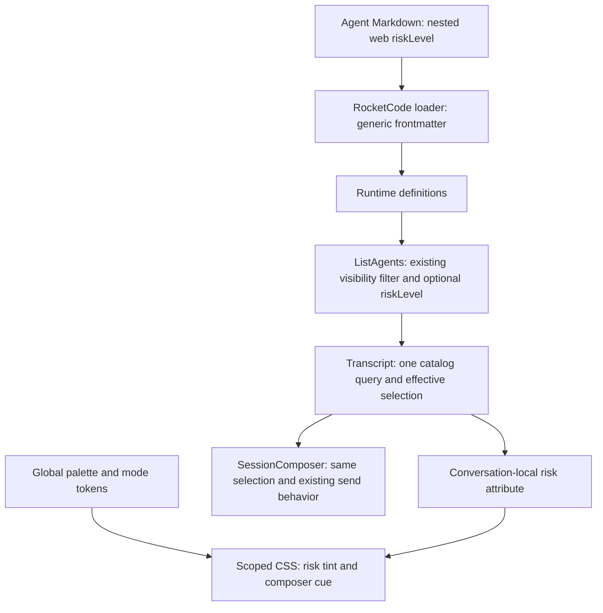
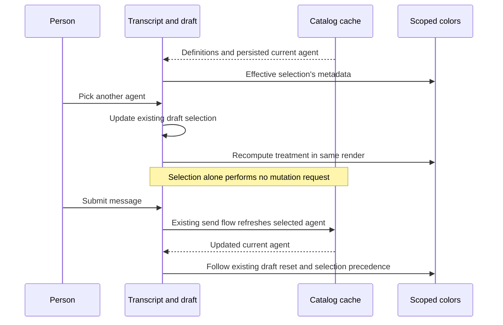
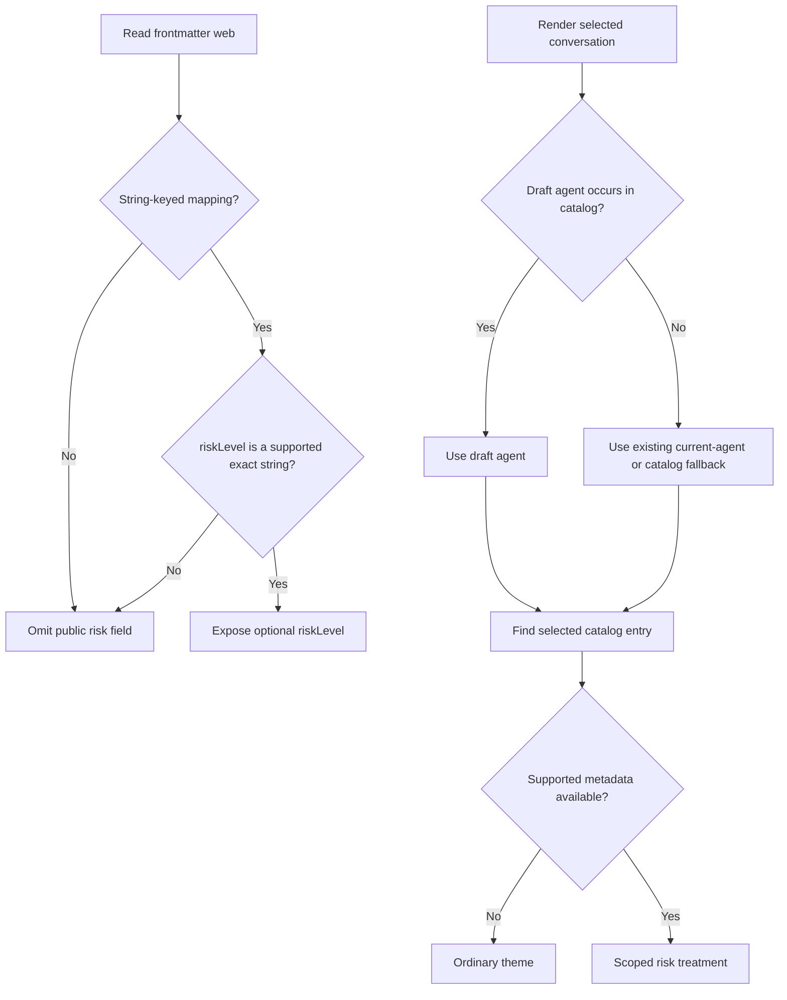
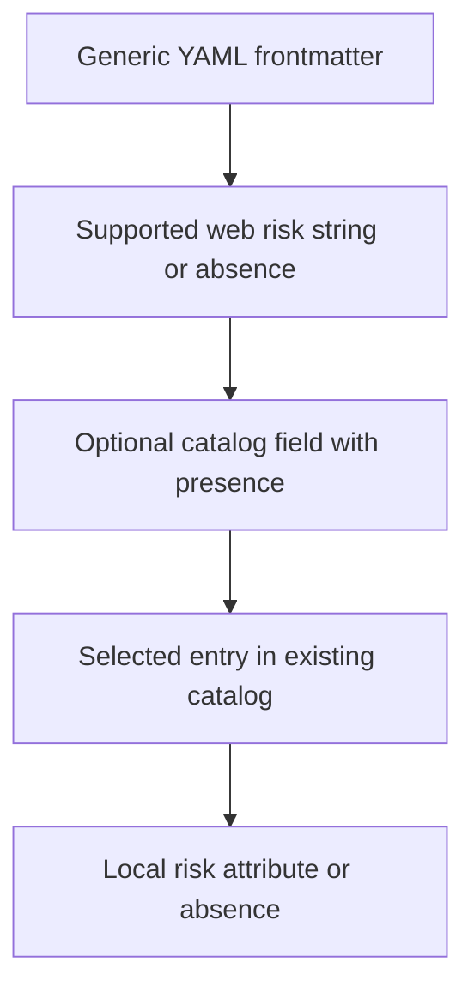

# Agent Risk Colors - Plan

## Goal Capsule

- **Objective:** People can recognize the selected agent's configured risk level from the web chat's colors before sending a message.
- **Means:** Project existing agent frontmatter into the agent catalog and apply a conversation-local color treatment (KTD1–KTD3).
- **Authority:** The requesting human owns the feature requirements. Repository instructions govern implementation; the Product Contract governs behavior, and the Planning Contract governs mechanism.
- **Execution profile:** One bounded feature change, implemented and verified in dependency order. No prototype or new dependency is needed.
- **Stop conditions:** Stop if the implementation needs to change permissions, persist new session state, widen the supported levels, or bypass a quality budget.
- **Landing strategy:** The parent implementation workflow owns verification, review, and opening the pull request; this artifact does not authorize deployment.

---

## Product Contract

### Summary

Agent files can choose `primary`, `warning`, or `danger` colors for the web chat through nested `web.riskLevel` frontmatter.
The selected agent controls the treatment before submission and when an existing session opens.
Agents without this metadata keep the current appearance.

### Problem Frame

The composer identifies agents by name and model, but its colors do not distinguish agents with different operational roles.
A visible cue can help people notice their selection without implying that the application has assessed or changed the agent's permissions.

### Requirements

**Metadata**

- R1. Accept nested agent YAML `web: { riskLevel: danger }`, with exactly `primary`, `warning`, and `danger` as supported values.
- R2. An omitted or unusable visual setting leaves the agent usable and applies no risk treatment; it does not introduce an agent-loading error.
- R3. The public agent catalog exposes supported risk metadata only for agents already visible through its existing access rules.

**Selection and appearance**

- R4. Selecting an agent updates the chat treatment in the same render as the picker selection, without waiting for submission or catalog polling.
- R5. Opening an existing session uses its current selected agent, with an eligible draft selection taking the same precedence as the existing composer picker.
- R6. Risk colors respect the selected palette and light, dark, or system mode; omission restores the exact ordinary treatment.
- R7. The treatment is local to the conversation pane containing transcript and composer; navigation, other screens, and other conversations retain their own appearance.
- R8. Text, controls, and focus indicators remain readable and usable at desktop and mobile sizes.

**Behavioral boundaries**

- R9. Risk metadata is visual only: it changes no permission, approval, model, prompt, queue, delivery, routing, or agent-selection behavior.
- R10. Use existing theme infrastructure without Bootstrap or another new dependency.
- R11. Document the YAML syntax, supported values, omitted-setting behavior, and visual-only meaning.

### Acceptance Examples

- AE1. **Covers R1, R4, R9.** Given an agent with `web.riskLevel: danger`, selecting it colors the conversation pane red before any request is sent; no selection command or permission change is triggered by coloring.
- AE2. **Covers R2, R6.** Switching from danger to an agent without `web` restores the ordinary theme; `web: null`, `web: danger`, a non-string level, `Danger`, and an unknown value also apply no treatment.
- AE3. **Covers R5, R7.** A saved session using a warning agent opens amber; switching to another conversation does not carry that treatment across, and returning to a retained draft restores that draft's selection.
- AE4. **Covers R6, R8.** While danger is selected, changing palette or switching to dark mode preserves the red cue and readable controls without changing saved theme preferences on the agent's behalf.

### Scope Boundaries

No editable appearance UI, custom color values, risk assessment, permission inference, agent badge system, Slack coloring, or runtime-security coupling.
No new persistence or migration: appearance follows the selected agent's loaded definition.
No restyling of global portal menus or unrelated message-status colors.

### Sources

- `internal/rocketcode/agents.go`: YAML parsing preserves generic `Agent.Frontmatter` alongside typed execution fields.
- `internal/rocketclaw/backend/bridge.go`: `loadRocketCodeDefinitionsIn` feeds runtime definitions from the agent loader.
- `internal/rocketclaw/frontend/rpc/server.go`: `listAgents` projects visible definitions and reports persisted `CurrentAgent`.
- `internal/rocketclaw/web/src/ui.tsx`: `Transcript`, `SessionComposer`, and `sendComposer` own session-local drafts, selection precedence, and submission.
- `internal/rocketclaw/web/app/globals.css` and `src/components/theme.tsx`: semantic colors, fourteen palettes, and mode persistence.

---

## Planning Contract

### Key Technical Decisions

- KTD1. **Keep web-only metadata out of the execution model.** Extract `web.riskLevel` from `Agent.Frontmatter` inline in `listAgents`, where definitions become web data. Accept a string-keyed YAML mapping and an exact supported string; omit other shapes and values under R2. This is boundary parsing, not a new loader validator. Avoid a shared RocketCode type, resolver callback, or feature-specific helper.
- KTD2. **Use one flat optional catalog field.** Append protobuf `optional string risk_level = 9` to public `Agent`; expose it as optional TypeScript `riskLevel` with the three-value literal union. Nested YAML is the input syntax, not a requirement to mirror it into an extra response message. Keep absence distinct from explicit `primary`, and never transmit arbitrary frontmatter. Regenerate `web.pb.go` and `protocol.gen.go` through the directives in `server.go`.
- KTD3. **Derive appearance from the picker selection, not a second state variable.** Move the existing session-specific agents query and the existing `currentAgent`, `catalog`, and `selected` derivation into `Transcript`. Pass these values to `SessionComposer` and leave its selection setter and submission behavior intact. Wrap the transcript/composer content in one flex column carrying `data-agent-risk` from the selected catalog entry. Preserve the existing query key and two-second polling interval; do not use an effect to modify `html`, `body`, or local storage.
- KTD4. **Tint surfaces with inherited colors instead of replacing the theme.** Use the existing `--primary` for primary and `--destructive` for danger. Add one amber `--warning` semantic source with light/dark values. Define conversation-local risk variables and mix the source with the inherited background/card/border colors. Apply the tint to the pane background and composer card, with a stronger composer border/focus cue. Keep normal text and destructive/status colors intact. Do not redefine `--background`, `--card`, or `--primary` from themselves: that creates variable cycles and can replace unrelated semantics. Tailwind v4's `@theme inline` already supports utilities backed by scoped variables (https://tailwindcss.com/docs/theme#referencing-other-variables).
- KTD5. **Prove the integration in existing test layers.** Extend the current loader and RPC tests, then use a small Bun/Playwright browser test against built assets for actual selection and computed styles. Do not export UI-only helpers or add a test framework solely to test a lookup.

### High-Level Technical Design

These sketches fix ownership and flow; they are not implementation code.

**Component ownership and data flow — KTD1–KTD4**



**Selection sequence — R4–R6**



**Input and selection branches — KTD1–KTD3**



**Public surface grammar — R1 and KTD2**

```text
Agent YAML: optional web mapping containing riskLevel
Supported riskLevel: primary | warning | danger
ListAgents agent entry: existing fields plus optional riskLevel
No supported metadata: riskLevel absent
```

**Data projection — KTD1–KTD3**



**Palette and mode combinations — R6, KTD4**

| Mode | Effective tokens | Configured risk source |
|---|---|---|
| Light | Selected palette's light surfaces | Primary, amber warning, or destructive red |
| Dark | Selected palette's dark surfaces | Primary, amber warning, or destructive red |
| System, light preference | Light tokens | Same mapping as light |
| System, dark preference | Dark tokens | Same mapping as dark |
| Any mode, metadata absent | Ordinary selected palette | No risk declarations |

### Assumptions

- “Composer screen” means the conversation pane, not application-wide navigation. The pane background and composer card should visibly change, rather than only a small picker label.
- Unsupported visual metadata is ignored under R2 because the existing loader accepts arbitrary frontmatter; rejecting it would add a new configuration-failure contract.
- `primary` means the chosen theme's primary color, not a fixed Bootstrap blue. Warning stays amber and danger stays red while their surfaces inherit the palette.
- Until catalog data is available, no supported risk metadata is known and the ordinary treatment remains; no new loading state or speculative cache is needed.

### Risks and Constraints

- A new flex wrapper can break transcript scrolling or mobile sizing. Preserve `min-h-0`, flex growth, disabled-fieldset behavior, and the existing message-scroller provider; test both viewport sizes.
- Inherited semantic variables do not cross DOM portals. Keep portal menus on the ordinary global theme per scope, and test that opening the agent picker remains readable.
- High-contrast palettes and yellow-toned palettes can hide a weak cue. Use browser checks for surface differences and contrast before choosing final mix strengths; keep the strong border/focus cue.
- Schema generation changes the protocol hash, which the existing browser cache uses for version isolation. Build schema, bindings, hash, and web assets together; do not hand-edit generated bindings or alter cache logic.
- Keep production changes inside RPC and the web UI. RocketCode needs only a test-fixture extension, not production changes. Apply the repository Go standards to actual touched hunks before edits, before tests, and after formatting/lint.
- Scratch files, browser profiles, screenshots, and tool temp directories stay under the workspace `.tmp/`; do not change budget constants or hide code in excluded paths.

---

## Implementation Units

### U1. Carry visual metadata through the public catalog

- **Goal:** Make loaded agent metadata available to the web without changing execution behavior.
- **Requirements:** R1–R3, R9; KTD1, KTD2, KTD5.
- **Dependencies:** None.
- **Files:** `internal/rocketcode/agents_test.go`; `internal/rocketclaw/frontend/rpc/server.go`, `server_test.go`, `web.pb.go`, `protocol.gen.go`; `internal/rocketclaw/web/proto/web.proto`, `src/types.ts`, `src/api.test.ts`.
- **Approach:** Add nested danger metadata to the existing valid-agent fixture and assert preservation beside its permission assertions. Add the schema field and catalog projection, regenerate from `server.go`, and update the frontend type. Extend the existing RPC catalog fixture with a compact metadata table; retain its `root.WriteFile` setup and visibility assertions. Extend the existing frontend catalog-response assertion to include `riskLevel`.
- **Test scenarios:** The loader preserves the nested map. The RPC table covers all three supported strings, omission, null/scalar `web`, and non-string/unknown/case-mismatched levels; unsupported values produce no optional field or catalog failure. Verify supported presence and omitted absence under the HTTP transport's protobuf JSON options. Existing ordering, filtering, current-agent, execution-field, and permission assertions remain unchanged.
- **Verification:** Targeted Go loader/RPC tests pass; the protocol-hash Bun test matches the regenerated schema and the web build type-checks.

### U2. Connect effective selection to scoped chat colors

- **Goal:** Give the selected agent a visible, theme-aware conversation treatment.
- **Requirements:** R4–R10; KTD3–KTD5.
- **Dependencies:** U1.
- **Files:** `internal/rocketclaw/web/src/ui.tsx`, `app/globals.css`.
- **Approach:** Apply KTD3 without duplicating selection state, queries, timers, or contexts. Add KTD4's scoped CSS and a composer-surface class at the existing `ComposerAttachments` card. Reuse inherited foregrounds and default button semantics; keep omission free of risk declarations. Exact amber values and tint strengths are visual implementation details, bounded by R8 and browser acceptance.
- **Execution note:** Use the built UI in the browser as the first styling proof; source-text assertions cannot prove CSS inheritance or contrast.
- **Test scenarios:** U3 checks picker changes, persisted selection, retained drafts, ordinary restoration, and palette/mode inheritance through the built UI. Retain existing `transcript.test.ts` and `session-list.browser.test.ts` coverage for message-flow behavior; no parallel send/stash failure fixture is needed. Keep the existing selection expression intact, including its empty-catalog and missing-definition behavior.
- **Verification:** Web lint and build pass; U3 proves computed styles, scroll sizing, and behavioral invariants.

### U3. Verify browser acceptance and document the setting

- **Goal:** Prove the end-to-end UI contract and make the setting discoverable.
- **Requirements:** R1–R11; AE1–AE4; KTD5.
- **Dependencies:** U2.
- **Files:** New `internal/rocketclaw/web/src/agent-risk.browser.test.ts`; `README.md`; `internal/rocketclaw/web/README.md`.
- **Approach:** Follow `session-commands.browser.test.ts`'s built-asset HTTP fixture and environment-selected Chromium. Keep typed fixtures for catalog/current-agent responses and record mutation requests. Extend agent-frontmatter docs in the root README and the web README's theme section.
- **Test scenarios:** Use one focused browser flow: open a persisted warning selection, pick each supported level and an unconfigured agent before sending, and navigate away and back to a retained draft. Hold subsequent catalog responses during picker changes to prove updates do not wait for polling; picker-only actions send no mutation. Submit once in an existing session to confirm the selected agent still reaches the existing agent-switch-before-prompt flow. Check pane/card/border computed styles, exact ordinary restoration, and unchanged sidebar/document colors and theme storage.
- **Theme matrix:** Reuse the browser fixture for a compact desktop loop over all `PALETTES` in light and dark mode with primary/warning/danger/omitted settings, plus one system-mode change. Check text on tinted surfaces at least 4.5:1 and the changed composer focus cue at least 3:1; do not build a general contrast-audit framework or re-audit unchanged controls. The tint must reflect the current base surface. Add one 390px smoke pass for picker usability, textarea focus, scrolling, overflow, and page errors rather than duplicating the full matrix on mobile.
- **Documentation:** Include `web:\n  riskLevel: danger`, enumerate values, explain R2/R6/R9, and retain the user's model/reasoning choices as unrelated settings. Do not suggest that `primary` means safe or that `danger` grants access.
- **Verification:** Browser acceptance actually runs against rebuilt assets with both required browser environment variables; docs match the tested syntax. A skipped browser test is not acceptance.

---

## Verification Contract

No tests or production edits are part of authoring this plan. The implementation must run the following gates and report any blocker rather than claiming success.

| Gate | Working directory | Command or check | Done signal |
|---|---|---|---|
| Schema generation | repository root | `go generate ./internal/rocketclaw/frontend/rpc` | Bindings and protocol hash match `web.proto` |
| Targeted Go tests | repository root | `go test ./internal/rocketcode ./internal/rocketclaw/frontend/rpc` | U1 scenarios execute, including DB-backed RPC coverage |
| Web quality | `internal/rocketclaw/web` | `make lint`, `bun run build`, `make test` | Type checking, React checks, Bun tests, and TS budget pass |
| Browser acceptance | `internal/rocketclaw/web` | `bun test src/agent-risk.browser.test.ts` with `ROCKETCLAW_PLAYWRIGHT_MODULE` and `ROCKETCLAW_CHROMIUM` set | U3 browser cases execute, not skip |
| Formatting and standards | repository root | `gofmt` on touched Go files; inspect `jj diff --git` | No unrelated edits, guards, wrappers, or abstractions |
| Full Go suite | repository root | `go test ./...` | All applicable tests execute successfully |
| Repository lint | repository root | `make lint` | Required lint/build gates pass; inspect automatic fixes |
| Repository tests and metrics | repository root | `make test` and `make check-cloc-budget` | Coverage and Go/TS budgets pass without changing limits |

Before starting these commands, place `TMPDIR` and `GOTMPDIR` beneath the workspace `.tmp/`.
Use the existing `ROCKETCLAW_TEST_DATABASE_URL` or the Makefile's PostgreSQL setup for DB-backed tests; passing with those tests skipped does not prove U1.
Build assets before browser acceptance because its fixture serves `internal/rocketclaw/internal/web/dist`.
Retain the existing protocol-isolation tests; regeneration must not invalidate their contract.

---

## Definition of Done

- U1 preserves YAML metadata and returns the supported optional field through the real catalog path without changing access rules or execution fields.
- U2 colors the pane from the actual effective selection and restores ordinary styling without residual state.
- U3 executes the browser matrix, proves behavioral isolation, and documents the setting in both READMEs.
- Every Verification Contract gate passes, with no required browser or DB scenario skipped.
- Inspect the final changed hunks again after generation and lint; remove abandoned experiments and unrelated changes.
- Permissions, prompt framing, queue order, delivery, outbound routing, and existing theme persistence remain unchanged under R9.
