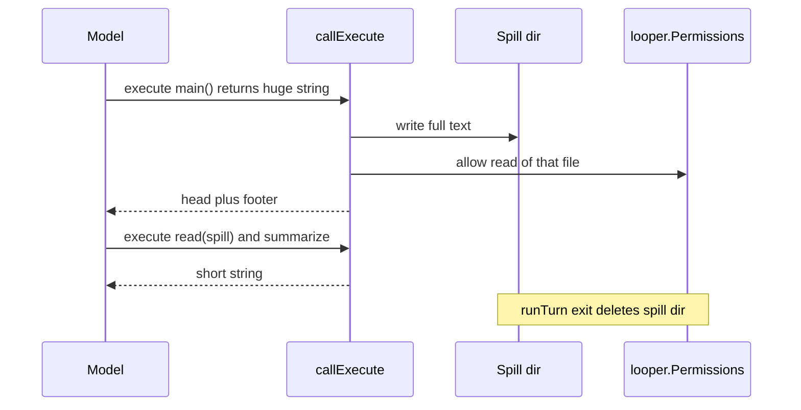
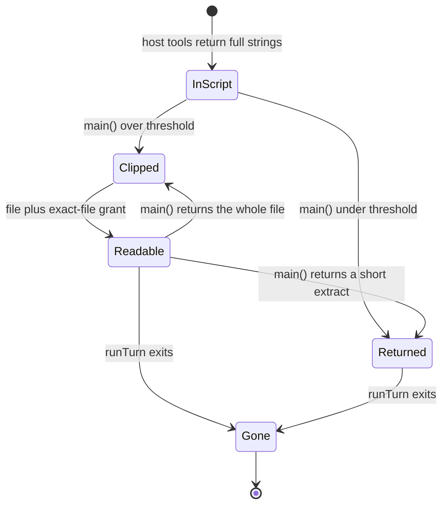

# Execute output spill - Plan

## Goal Capsule

- **Objective:** Oversized `execute` results no longer blow the model context. The model can still inspect the full text in the same turn. After the turn ends, that text is gone.
- **Means:** Uncap host-tool display inside execute. Clip only the string `callExecute` returns to the model. Spill the full text to a turn-scoped file, grant exact-file read, delete the file when the turn exits (KTD1, KTD2, KTD4).
- **Authority:** This plan > remembered path `.rocketclaw/.femtoclaw` (that nested path never existed) > old bash 6h TTL + conversation-tree grant.
- **Stop when:** Host tools return full strings inside execute. Oversized `execute` results are a head plus footer. The spill file is readable in that turn and gone after every exit path. CLOC budgets hold.
- **Out of scope:** Task-child final answers. Webfetch 5MB abort. `.env` deny. A permission revoke API. Session-temp tree grants.

---

## Product Contract

### Summary

Uncap every host-tool result inside execute. Clip only the execute result the model sees. Spill the full text to a turn-scoped file, auto-allow read of that file, and delete the file when the turn ends.

### Problem Frame

Code mode replaced the top-level bash tool. Bash used to clip large output and point at a temp file. Execute now returns one uncapped string (`callExecute` → `TextToolResult`). Large `main()` returns trigger `context_length_exceeded`. The current bash split (`head_output` / `full_output`) is the opposite of the old contract: the full text lives in Starlark and is easy to send back to the model.

### Key Decisions

- Uncap everything inside execute. (session-settled: user-directed — chosen over clipping only the execute return and leaving nested host caps: internal dual-output is what blows context.) Governs R1, R2.
- Clip only at the execute→model boundary. Spill full text to a turn-scoped temp file. Footer: read that file to see all; the file is gone at end of turn. (session-settled: user-directed — chosen over keeping bash `full_output` as the overflow path.) Governs R3, R4, R5.
- Auto-grant read on only that file. Accumulate grants during the turn. When the turn ends, the file and that grant are gone. (session-settled: user-directed — chosen over the old conversation-wide temp-tree grant.) Governs R6, R7.

### Requirements

**Inside execute**

- R1. Host tools inside execute return one full string. No display clip, no dual head/full payload.
- R2. `read` `offset` stays as an explicit start line. It is not a hidden remaining window.

**Execute→model boundary**

- R3. Only the string `callExecute` returns to the model is size-limited.
- R4. An oversized result writes the full text to a turn-scoped file and returns a clipped head plus a footer.
- R5. The footer names `execute` / `read(filePath=...)`. It says the file is gone at end of turn. It says returning the whole file from `main()` spills again.

**Permission and lifetime**

- R6. Each spill file gets an exact-file `read` allow on the live looper. Grants accumulate. No directory, glob, or edit grant.
- R7. When the turn ends (success, error, or interrupt), spill files are deleted. Those grants do not survive as a way to read the text.

### Success Criteria

- A large `return bash(...)` or `return read(...)` does not send the full text to the model.
- In the same turn, a later execute can `read` the spill file and return a short extract.
- After the turn exits, the spill file is gone.

### Actors

- A1. Agent (model) calling `execute`
- A2. RocketCode looper
- A3. RocketClaw bridge (per-turn looper for managed Slack / clockwork / exec)

### Key Flows

- F1. Oversized execute
  - **Trigger:** `main()` returns a string over the clip threshold.
  - **Steps:** Write spill file. Grant exact-file read. Bind `read` if it is not already a host. Return head plus footer.
  - **Covered by:** R3, R4, R5, R6
- F2. In-script recovery
  - **Trigger:** Agent follows the footer.
  - **Steps:** Later execute calls `read` on the spill path, slices or searches in Starlark, returns a small string.
  - **Covered by:** R5, R6
- F3. Re-spill
  - **Trigger:** Agent `return`s the whole spill file from `main()`.
  - **Steps:** Clip again. New file. New grant. Same footer.
  - **Covered by:** R3, R4, R5, R6
- F4. Turn end
  - **Trigger:** `runTurn` exits.
  - **Steps:** Delete this turn's spill files on success, error, and interrupt.
  - **Covered by:** R7

### Acceptance Examples

- AE1. Covers R1. Given a bash command that prints 3000 lines, when Starlark reads `bash(...).` as a string, then the value has all 3000 lines and no `full_output` attribute.
- AE2. Covers R3, R4. Given `main()` returns 3000 lines, when execute completes, then the model sees a 2000-line / 50KB head plus the footer, and the full text is on disk.
- AE3. Covers R5, R6. Given that spill file, when a later execute in the same turn calls `read(filePath=spill)` and returns a 10-line extract, then that extract is the tool result and no new spill is required.
- AE4. Covers R6. Given an agent whose only read grant is this spill file, when execute tries `read` on any other workspace path, then the nested permission check denies it.
- AE5. Covers R7. Given a completed, failed, or interrupted turn that spilled, when the next inspection runs, then the spill file is gone.

### Scope Boundaries

- Do not clip `task` child final answers.
- Do not remove webfetch's 5MB fetch abort or `.env` deny.
- Do not grant or reuse the session shell-temp tree (`.rocketclaw/.rocketcode/tmp/<conversation>/`) for spills.
- Do not add a `PermissionSet` revoke API.
- Do not create `.rocketclaw/.femtoclaw`. That nested path never existed. `.femtoclaw` is the legacy runtime root, sibling of `.rocketclaw`.

#### Deferred to Follow-Up Work

- Clip `task` child final answers if children start pasting huge files into the parent.
- Teach recovered-interrupt replay to tolerate a footer whose file is already gone (R7 deletes on interrupt).

---

## Planning Contract

### Key Technical Decisions

- KTD1. Put the size gate in `callExecute` after `codemode.Run`, not in `looper.dispatchToolCalls`. Dispatch also carries `task`, `skill`, and custom tools.
- KTD2. Write spills under `<runtimeDir>/.rocketcode/spill/<turn-id>/` via `*os.Root`. Do not use the session temp tree. Do not invent `.rocketclaw/.femtoclaw`. (Conflict with the remembered path: historical temp was embedder `ShellTempDir`, now `<runtimeDir>/.rocketcode/tmp/<conversation>/`. The session temp tree already has a bash-implied read+glob grant, so a spill there would be readable next turn without an exact-file grant.)
- KTD3. Append exact-file `read` allow on the live `looper.Permissions` (last match wins). Do not add revoke. RocketClaw builds a new looper per turn. Standalone `Loop` may reuse a looper; leftover grants then hit a missing file.
- KTD4. Delete the turn's spill directory inside RocketCode on every `runTurn` exit. Do not rely on RocketClaw `ClearCompletedTurn` (DB-only; unused by task / side-ask / Development MCP / `exec`). (Conflict with the confirmed RocketClaw-owns-delete split: that split cannot honor R7 on those runtimes.)
- KTD5. Clip threshold is a 2000-line head and a 50KB head, matching today's read display. Not a tail.
- KTD6. Bind host `read` when a spill grant is added if `read` is not already a code host. Otherwise MCP-only agents cannot follow the footer.
- KTD7. Delete bash `HeadOutput` / `full_output` / `head_output`. Keep `error_code`. Delete read's 2000-line, 50KB, and 2000-char line caps. Delete glob/grep 100-result caps and grep line trim. Pay CLOC by removing `bashStarlarkResult` dual attrs.

### High-Level Technical Design

### Assumptions

- "Turn" means one `runTurn`, not one execute call and not one Slack thread lifetime.
- Parallel execute calls in one turn each get their own spill file and grant.
- `read: *` agents can already reach the spill dir. Exact-file grant is for narrow agents such as default `main`.

### Implementation Constraints

- Rocketcode `GO_SOURCE_CLOC_BUDGET=10500`. Delete the bash dual-output types to pay for clip/spill.
- Write and delete spill files through `*os.Root`. Tests must create fixtures the same way.
- No Windows paths.

### Sequencing

U1 (uncap) before U2 (clip/spill). U2 before U3 (delete). Footer copy in U2 so U3 tests can assert the dead-path contract.

---

## Implementation Units

### U1. Uncap host-tool results inside execute

- **Goal:** Inside execute, bash, read, glob, and grep return full untruncated strings.
- **Requirements:** R1, R2. KTD7.
- **Dependencies:** none
- **Files:**
  - `internal/rocketcode/shell.go`
  - `internal/rocketcode/bash_starlark.go`
  - `internal/rocketcode/filesystem.go`
  - `internal/rocketcode/shell_test.go`
  - `internal/rocketcode/bash_starlark_test.go`
  - `internal/rocketcode/filesystem_test.go`
- **Approach:**
  1. Make `BashResult.String()` the full output. Drop `HeadOutput` and the `full_output` footer.
  2. Collapse the Starlark bash value to the full string plus `error_code`.
  3. Remove `defaultReadLimit`, `maxBytes`, and per-line trim from `readLines`. Keep `offset`.
  4. Remove glob/grep 100-result caps and grep line trim.
- **Patterns to follow:** Existing `*os.Root` fixture style in `filesystem_test.go`.
- **Test scenarios:**
  - Covers AE1. Bash of 3000 lines: `String()` has all lines. No `head_output` / `full_output` attrs.
  - `read` of a 3000-line file with no offset returns every line.
  - `read` with `offset=2001` starts at line 2001 and continues to EOF.
  - `read` of a single 80KB line is not char-trimmed.
  - Glob of 101 files lists all 101 with no truncation footer.
  - Grep with 101 matches lists all 101 with no truncation footer.
- **Verification:** Those tests pass. No host-tool result string contains `full_output` or "Results are truncated".

### U2. Clip, spill, grant, and teach at callExecute

- **Goal:** Oversized execute results become a head, a spill file, an exact-file read grant, and a footer the model can follow.
- **Requirements:** R3, R4, R5, R6. KTD1, KTD2, KTD3, KTD5, KTD6.
- **Dependencies:** U1
- **Files:**
  - `internal/rocketcode/mcp_tools.go`
  - `internal/rocketcode/looper.go`
  - `internal/rocketcode/permission.go` (only if `Allow` must be called on the live set)
  - `internal/rocketcode/mcp_tools_test.go`
  - `internal/rocketcode/looper_test.go`
- **Approach:**
  1. After `codemode.Run`, if the result exceeds KTD5, write the full text under KTD2 and return a KTD5 head plus R5 footer.
  2. Append exact-file `read` allow on the live looper permissions.
  3. Bind host `read` for the rest of the turn if it is not already a code host.
  4. Add one catalog line in the code-mode system prompt so the agent sees the contract before the first spill.
- **Execution note:** Start with a failing contract test for oversized `main()` → clipped output + file exists + nested `read` of that path allowed.
- **Patterns to follow:** `TextToolResult` in `callExecute`. `PermissionSet` last-match-wins. `root.WriteFile` at `0o600`. Do not copy `shellTempConfig.effectivePermissions`.
- **Test scenarios:**
  - Covers AE2. `main()` returns 3000 lines: model output is the KTD5 head plus footer. File contains the full 3000 lines.
  - Result under both caps is returned unchanged. No file. No grant.
  - Covers AE3. Later execute in the same turn `read`s the spill and returns a 10-line extract: that extract is the tool result.
  - Covers AE4. Nested `read` of a non-spill path is still denied for a narrow agent.
  - Nested `glob` or `edit` on the spill path is not granted by the spill rule.
  - Two parallel oversized executes produce two files and two grants.
  - An MCP-only agent that spills can `read` the spill file afterward.
  - Footer does not say "call the read tool". It names `execute` / `read(filePath=...)`, end of turn, and re-spill if `main()` returns the whole file.
- **Verification:** Contract tests pass. Session-temp tree grant tests still pass and do not cover the spill dir.

### U3. Delete spill files on every runTurn exit

- **Goal:** Spill files do not survive the turn that created them.
- **Requirements:** R7. KTD4.
- **Dependencies:** U2
- **Files:**
  - `internal/rocketcode/looper.go`
  - `internal/rocketcode/looper_test.go`
  - `internal/rocketcode/checkpoint.go` (only if a cleanup hook is the smallest way to run on every exit; prefer a `defer` in `runTurn`)
- **Approach:**
  1. On every `runTurn` return, delete `<runtimeDir>/.rocketcode/spill/<turn-id>/`.
  2. Cover success, error, and interrupt. Do not wait for `ClearCompletedTurn`.
  3. Do not add RocketClaw sink behavior. Optional later: mention the dir in runtime-state docs if README already lists temp paths.
- **Patterns to follow:** Side-ask / Development MCP `defer root.RemoveAll` for private temp dirs. Prefer that local `defer` over a new sink method.
- **Test scenarios:**
  - Covers AE5. After a successful turn that spilled, the spill dir is gone.
  - After a tool error that spilled, the spill dir is gone.
  - After interrupt that spilled, the spill dir is gone.
  - A later turn cannot `read` the previous turn's spill path.
- **Verification:** Those tests pass. `ClearCompletedTurn` stays a DB-only checkpoint clear.

---

## Verification Contract

| Gate | Command | Proves |
|---|---|---|
| Uncap + clip + cleanup | `go test ./internal/rocketcode ./internal/rocketcode/codemode` | U1–U3 |
| Format | `gofmt` on touched files | style |
| Full | `go test ./...` | no collateral break |
| Lint + CLOC | `make lint` and `make test` from `internal/rocketcode` | budgets and lints |

---

## Definition of Done

- R1 and R3–R7 hold under AE1–AE5. R2 (read offset stays a start line) holds under the U1 offset tests.
- U1–U3 verification fields pass.
- Rocketcode CLOC budget is not exceeded.
- Abandoned helpers (`firstLines`, dual bash attrs, unused clip footers) are deleted.
- README impact considered: update only if the existing runtime-state list names temp dirs and omits the new spill dir.

---

## System-Wide Impact

Default `main` has no `read: *`. The exact-file grant is what makes the footer usable. The session temp tree grant stays for bash `TMPDIR` only. Prompt context grows by one catalog line plus per-spill footers.

---

## Risks & Dependencies

- Uncapped host tools hold full payloads in Starlark before the boundary clip. Wide `grep` can OOM or hit the Starlark step budget. Accept for this change.
- Interrupt recovery may replay a footer whose file U3 already deleted. Deferred.
- CLOC is tight. U1 deletions must land with U2 additions.
