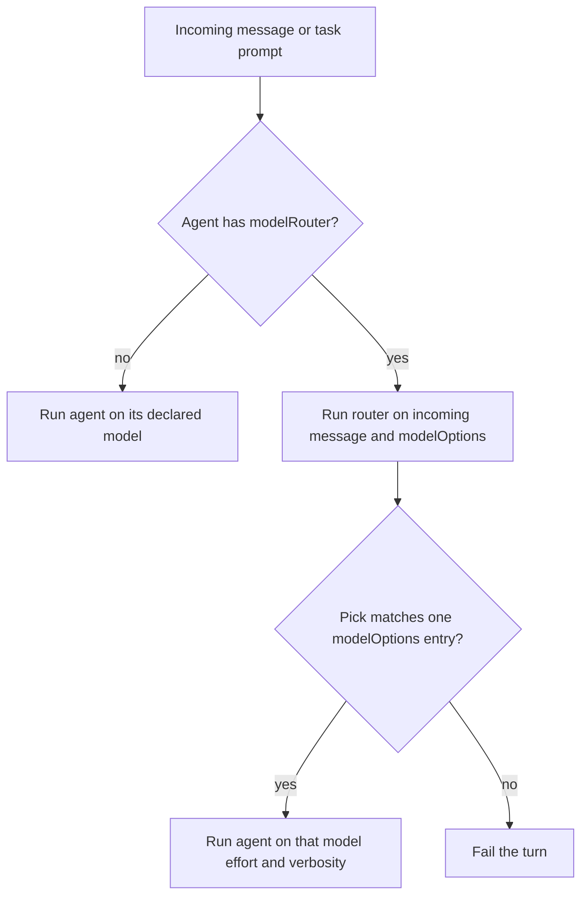

# Agent model router - Plan

## Goal Capsule

- **Objective:** An operator can declare a named model router on an agent so each turn of that agent uses one validated model choice, without changing how messages are handled.
- **Means:** Hidden structured child run plus turn-start rebind (KTD1, KTD2).
- **Authority:** This plan > Product Contract IDs > existing guardrail/guardian child-run pattern.
- **Stop when:** Load, lint, turn, and task paths honor R1–R11. Tests below are green. RocketCode source CLOC stays under 10500.
- **Open blockers:** None.

---

## Product Contract

### Summary

An agent may name another agent as its model router. Before that agent runs, the router receives the incoming message and the allowed choices, and returns one `model`, `reasoningEffort`, and `verbosity`. Message handling stays the same. Only the model choice changes.

### Problem Frame

Agents pick one static model today. There is no way for one agent definition to choose a cheaper or stronger model from a declared set based on the incoming message. Operators do not currently work around this.

### Key Decisions

- KD1. **Named router agent, not a built-in picker.** (session-settled: user-directed — chosen over a smaller form without a named router: the router agent is required.) Governs R1, R6.
- KD2. **No host model fields when routing is on.** (session-settled: user-directed — chosen over required or optional fallback model fields: a failed pick must not silently use a host model.) Governs R3, R9.
- KD3. **Re-pick every user turn.** (session-settled: user-directed — chosen over once-per-conversation: follow-ups may switch models.) Governs R5.
- KD4. **Task calls route on the task prompt.** (session-settled: user-directed — chosen over rejecting task targets: a routed agent still accepts `task`.) Governs R7.
- KD5. **A router agent cannot itself use a router.** Lint and load reject that. Governs R10.

### Requirements

**Declaration**

- R1. An agent may set `modelRouter` to the name of another loaded agent.
- R2. When `modelRouter` is set, `modelOptions` is required. It is a list of allowed choices. Each choice has `model`, `reasoningEffort`, and `verbosity`.
- R3. When `modelRouter` is set, the agent must omit `model`, `reasoningEffort`, and `verbosity`. Load rejects those fields on that agent.
- R4. When `modelRouter` is omitted, agent model rules stay as they are today: `model` is required.

**Routing**

- R5. On each new human message to a routed agent, run its router before that agent answers. Use the returned choice for that turn only.
- R6. Give the router the incoming message and the agent's `modelOptions`. Do not change how the routed agent's messages are collected, stored, or shown.
- R7. When another agent calls `task` on a routed agent, treat the task prompt as the incoming message and apply R5–R6.
- R8. The router returns structured `model`, `reasoningEffort`, and `verbosity`. That triple must match one `modelOptions` entry.

**Failure and lint**

- R9. If the router is missing, fails, times out, returns invalid structure, or returns a triple not in `modelOptions`, the turn fails. There is no fallback model.
- R10. An agent named as anyone's `modelRouter` must not itself set `modelRouter`. Load and lint reject that.
- R11. A missing `modelRouter` target, missing `modelOptions` on a routed agent, or empty `modelOptions` fails load the same way a missing guardrail target does.

### Actors

- A1. Operator who writes agent files.
- A2. Routed agent: has `modelRouter` and `modelOptions`.
- A3. Router agent: named by `modelRouter`, has its own static `model`.
- A4. Caller: a human message, or a parent agent using `task`.

### Key Flows



- F1. Human turn
  - **Trigger:** A human sends a message to a routed agent.
  - **Actors:** A1, A2, A3, A4
  - **Steps:** Run A3 with the incoming message and A2's `modelOptions`. If the pick matches one option, run A2 with that choice. Otherwise fail the turn.
  - **Covered by:** R5, R6, R8, R9
- F2. Task turn
  - **Trigger:** A parent agent calls `task` on a routed agent.
  - **Actors:** A2, A3, A4
  - **Steps:** Same as F1, using the task prompt as the incoming message.
  - **Covered by:** R7, R8, R9
- F3. Invalid pick
  - **Trigger:** The router returns JSON that is not one `modelOptions` entry, or the router run fails.
  - **Outcome:** The routed agent does not run. The turn fails.
  - **Covered by:** R9

### Acceptance Examples

- AE1. Valid pick
  - **Covers R5, R8.**
  - **Given:** `main` has `modelRouter: costEffectiveRouter` and two `modelOptions` entries.
  - **When:** A human message arrives and the router returns the first entry exactly.
  - **Then:** `main` runs that turn with that model, effort, and verbosity. Conversation handling matches an unrouted agent.
- AE2. Follow-up re-picks
  - **Covers R5.**
  - **Given:** AE1 already ran.
  - **When:** The human sends another message.
  - **Then:** The router runs again. `main` uses this turn's pick, which may differ from the previous turn.
- AE3. Rejected pick
  - **Covers R8, R9.**
  - **Given:** The same `main` as AE1.
  - **When:** The router returns a model that is not in `modelOptions`.
  - **Then:** `main` does not run. The turn fails.
- AE4. Task prompt
  - **Covers R7.**
  - **Given:** A parent agent calls `task` on `main` with prompt `review this diff`.
  - **When:** Routing runs.
  - **Then:** The router receives `review this diff` as the incoming message.
- AE5. Host model forbidden
  - **Covers R3.**
  - **Given:** An agent sets both `modelRouter` and `model`.
  - **When:** Agents load.
  - **Then:** Load fails.
- AE6. Router cannot route
  - **Covers R10.**
  - **Given:** `main` sets `modelRouter: costEffectiveRouter`, and `costEffectiveRouter` also sets `modelRouter`.
  - **When:** Agents load or lint runs.
  - **Then:** Load and lint fail.

### Scope Boundaries

- In scope: `modelRouter` and `modelOptions` on agents; per-turn routing; task invocations; fail-closed validation; load and lint for the declaration rules.
- Not in scope: Changing Slack or conversation behavior.
- Not in scope: Giving a router agent its own router.
- Not in scope: A built-in picker that replaces the named router agent.
- Not in scope: Mid-turn model switching after the routed agent has started.

### Dependencies / Assumptions

- The operator writing agent files is the primary actor.
- Cron, workflow, and other starts that already feed an incoming prompt into an agent use that same prompt as the incoming message in R6. They do not get a new message-handling path.
- `modelOptions` `model` values use the same naming as today's agent `model` field, including configured model mappings.

### Outstanding Questions

- Deferred to Planning: whether the router child may use tools, and how existing child-run diagnostics apply. Resolved in KTD2.
- Deferred to Planning: how `modelOptions` is shown to the router, as long as R6 holds. Resolved in KTD2.

### Sources / Research

- Agent frontmatter and required `model`: `internal/rocketcode/agents.go`, `cmd/rocketclaw/CHEATSHEET.md`
- Hidden structured child runs (guardrail, permission review): `internal/rocketcode/tasks.go`, `internal/rocketcode/permission_review.go`
- One model per looper run: `internal/rocketcode/rocketcode.go`, `internal/rocketclaw/docs/specs/2026-07-28-multi-provider-model-resolution-design.md`
- Lint for missing guardrail and `reasoningEffort` xhigh: `internal/rocketclaw/agentlint/agentlint.go`

### Product Contract preservation

Product Contract unchanged.

---

## Planning Contract

### Key Technical Decisions

- KTD1. **Bind the pick at turn start, not at `New`.** `NewWithModelResolver` cannot see the incoming message. `Loop` is multi-turn. Rebind `Client`, `Model`, `DisplayModel`, `ReasoningEffort`, and `Verbosity` only inside `runTurn`. `runTask` constructs a routed child with those fields unset and lets `Loop` bind once. Cites R5, R7.
- KTD2. **Clone `runGuardrail`, do not add a child-run framework.** Fixed JSON schema `model` / `reasoningEffort` / `verbosity`. Ignore the router agent's `schema.output`. Feed one user message that contains the incoming text plus the `modelOptions` list. Router tools follow the router agent's own `permission`. Diagnostics follow the existing child-run path. Cites R6, R8.
- KTD3. **All `modelOptions` models must share one provider.** Harnessbridge filters session history by provider from `DisplayModel` before `Loop`. Mixed providers would change replay without a new message path. Load rejects mixed providers. Cites R2, R6.
- KTD4. **Keep the tool factory on the root looper** so `runTurn` can spawn the router child. Today the factory is only `PermissionReviewer`.
- KTD5. **A routed agent cannot be a guardrail or permission reviewer.** Those paths require a static `Model`. Load rejects that use. Not in the Product Contract; keeps v1 off those paths.

### High-Level Technical Design

```mermaid
sequenceDiagram
  participant Caller
  participant Loop
  participant Router
  participant Model
  Caller->>Loop: incoming text
  alt agent has modelRouter
    Loop->>Router: text plus modelOptions
    Router-->>Loop: model reasoningEffort verbosity
    alt triple matches one option
      Loop->>Loop: rebind client and model
      Loop->>Model: runTurn
    else miss or failure
      Loop-->>Caller: turn fails
    end
  else static model
    Loop->>Model: runTurn
  end
```

### Assumptions

- Slack, cron, side-ask, and raw runs already create one Runtime per turn. Re-pick still lives in `runTurn` so a long-lived `Loop` is correct.
- For a routed default agent, `New` skips `resolveModel` of the work model but still sets `DisplayModel` and `ProviderOrigin.Provider` from the shared `modelOptions` provider (KTD3) so harnessbridge session filter stays unchanged.
- Empty incoming text with attachments still runs the router on that empty text.
- A workflow `worker(..., model=...)` overwrite on a routed agent is out of this plan. The worker prompt still goes through R6.

### Implementation Constraints

- RocketCode source CLOC budget is 10500. Current source is about 9221. Prefer extending `runGuardrail` over new types.
- Do not use `config.Model` or `config.ReasoningEffort` as a failed-pick fallback (KD2, R9).
- `validateAgentModels` must skip routed agents. Their `Model` is empty by contract.
- Unix-like only. No Windows paths.

### Sequencing

1. U1 load and lint so routed fixtures can exist.
2. U2 New and factory so a routed default agent can construct.
3. U3 turn and task bind.
4. U4 docs.

### System-Wide Impact

Operators author `modelRouter` / `modelOptions`. Slack message collection does not change. Create-or-update-agent skill and CHEATSHEET must stop saying `model` is always required.

### Risks

- Cross-provider allowlists are rejected (KTD3). Same-provider options are the v1 surface.
- CLOC: a second copy of `runGuardrail` can blow the budget. Keep the child runner thin.

---

## Implementation Units

### U1. Parse modelRouter and modelOptions

- **Goal:** Load accepts routed agents and rejects illegal declarations.
- **Requirements:** R1, R2, R3, R4, R10, R11. KD1, KD5. AE5, AE6.
- **Files:** `internal/rocketcode/agents.go`, `internal/rocketcode/agents_test.go`, `internal/rocketcode/rocketcode.go`, `internal/rocketcode/main_test.go`, `internal/rocketclaw/agentlint/agentlint.go`, `internal/rocketclaw/agentlint/agentlint_test.go`, `cmd/rocketclaw/lint_test.go`
- **Approach:** Parse `modelRouter` as a string. Parse `modelOptions` as a YAML list of mappings. Resolve each option `model` with the existing `resolveModel` callback. When `modelRouter` is set, require non-empty options, omit host model fields, and record the fields on `Agent`. After all agents load, reject missing targets, router-on-router, mixed providers (KTD3), and routed agents used as guardrail or reviewer (KTD5). Add lint findings for the same graph errors. Load must succeed without `model` or lint never sees the file.
- **Test scenarios:**
  - Happy: routed agent with two options and a static router loads. Host `Model` is empty.
  - Edge: `{{ model "name" }}` in an option resolves through `RenderAgentModel`.
  - Error: unrouted missing `model`, empty options, host `model` plus `modelRouter`, missing target, router-on-router, mixed providers, routed guardrail. Each fails load or lint.
- **Verification:** `go test ./internal/rocketcode/ ./internal/rocketclaw/agentlint/ ./cmd/rocketclaw/ -count=1`
- **Dependencies:** none

### U2. Construct a routed root runtime

- **Goal:** `NewWithModelResolver` can start a routed default agent without a host model.
- **Requirements:** R3, R4. KTD1, KTD4.
- **Files:** `internal/rocketcode/rocketcode.go`, `internal/rocketcode/models.go`, `internal/rocketcode/models_test.go`, `internal/rocketcode/main_test.go`
- **Approach:** Skip `resolveModel` of the work model and leave looper `Client`/`Model` unset until the first routed turn. Set `DisplayModel` and `ProviderOrigin.Provider` from the shared `modelOptions` provider so existing harnessbridge filters keep working. Keep the tool factory on the looper. Skip routed agents in `validateAgentModels`. Unrouted agents stay required-model.
- **Test scenarios:**
  - Happy: `NewWithModelResolver` succeeds for a routed `main` and a static `main`.
  - Error: unrouted empty `Model` still fails (`TestNewWithProvidersRejectsEmptyAgentModel`).
- **Verification:** `go test ./internal/rocketcode/ -count=1 -run 'TestNew'`
- **Dependencies:** U1

### U3. Route at turn start and on task

- **Goal:** Each human turn and each `task` onto a routed agent binds one validated option or fails.
- **Requirements:** R5, R6, R7, R8, R9. KTD1, KTD2. AE1, AE2, AE3, AE4.
- **Files:** `internal/rocketcode/looper.go`, `internal/rocketcode/looper_test.go`, `internal/rocketcode/tasks.go`, `internal/rocketcode/tasks_test.go`, `internal/rocketcode/rocketcode.go`
- **Approach:** Add `runModelRouter` beside `runGuardrail`. Call it only from `runTurn` on `line.Text`. In `runTask`, if the target has `modelRouter`, skip `resolveModel` and build the child with unset `Client`/`Model` the same way U2 builds a routed root. `Loop` then binds once on `params.Prompt`. On a miss, return an error. Do not write router output into the parent session. Add a `ChildRunKind` for operator logs. Execution note: write the failing tests first (AE1–AE4), then the bind.
- **Test scenarios:**
  - Happy: first option returned → child API sees that model, effort, and verbosity.
  - Happy: second user line → router runs again and can return the other option (AE2).
  - Happy: `task` prompt is the router user text (AE4).
  - Error: invalid JSON, unknown triple, router `Loop` error → parent turn/task fails and the work model is not called (AE3).
  - Integration: unrouted agent path unchanged.
- **Verification:** `go test ./internal/rocketcode/ -count=1 -run 'ModelRouter|Task|Looper'`
- **Dependencies:** U2

### U4. Docs and authoring skill

- **Goal:** Operators see that `model` is required unless `modelRouter` is set.
- **Requirements:** R1–R4, R10. A1.
- **Files:** `cmd/rocketclaw/CHEATSHEET.md`, `README.md`, `internal/rocketclaw/skel/.rocketclaw/skills/main-create-or-update-agent/SKILL.md`
- **Approach:** Document `modelRouter` and `modelOptions`. Say `model` is required when `modelRouter` is omitted. Note router-on-router is rejected and `xhigh` still lints on options and on the router agent.
- **Test scenarios:** none — docs only.
- **Verification:** read the three files for the new fields and the conditional `model` rule.
- **Dependencies:** U1

---

## Verification Contract

- `gofmt` on every touched Go file.
- `go test ./internal/rocketcode/ ./internal/rocketclaw/agentlint/ ./internal/rocketclaw/harnessbridge/ ./cmd/rocketclaw/ -count=1`
- `make lint` and `make test` from the repo root.
- RocketCode source CLOC remains under 10500.

## Definition of Done

- R1–R11 hold in tests named above.
- AE1–AE6 have a test or a load/lint assertion.
- CHEATSHEET and the create-or-update-agent skill no longer say every agent must set `model`.
- No leftover prototype types or unused helpers.
- README impact considered: README must mention the conditional `model` rule (U4).
