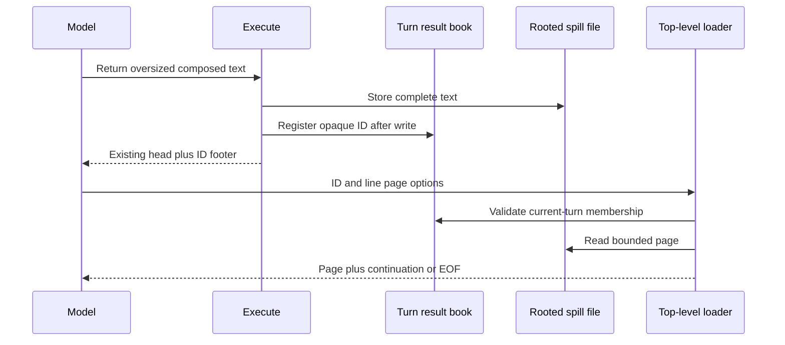
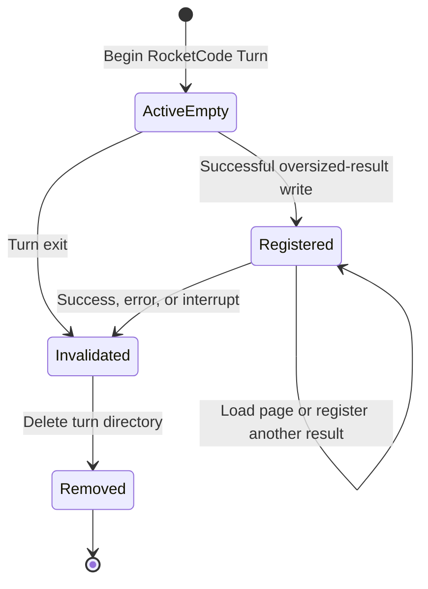
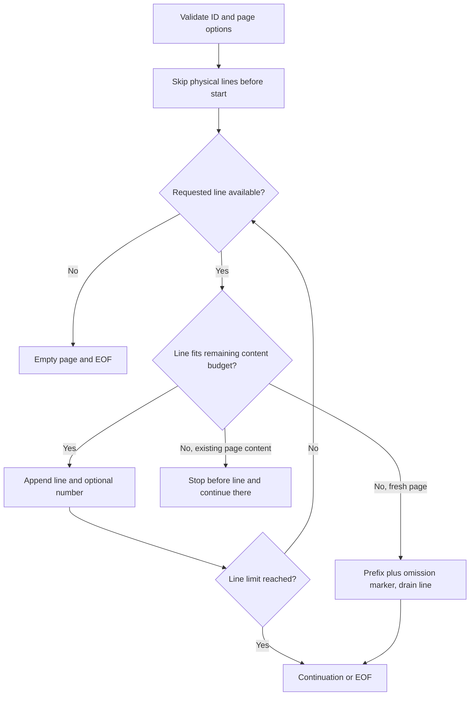

# Load Execute Result - Plan

## Goal Capsule

- **Objective:** The model can inspect oversized tool results during the current turn without overflowing its context or acquiring filesystem access.
- **Means:** Replace path-based spill recovery with the top-level `load_execute_result` tool (R3–R7, KTD1–KTD4).
- **Authority:** This Product Contract and the invoking feature brief supersede the recovery mechanism in `internal/rocketcode/docs/plans/2026-08-24-1315-feat-execute-output-spill-plan.md`. Existing host-output, clipping, and turn-lifetime contracts remain authoritative through R1, R2, and R8.
- **Stop when:** U1–U3 satisfy the Verification Contract and no recovery-specific read grants, bindings, or path-reuse logic remain.
- **Execution profile:** Focused RocketCode change; the downstream executor owns implementation, verification, review, and shipping. This document does not authorize unrelated cleanup.

---

## Product Contract

### Summary

Expose `load_execute_result` beside Execute so the model can request bounded pages using an opaque result ID. Preserve generic Execute clipping and full turn-scoped storage, while removing implicit filesystem read recovery.

### Problem Frame

Execute protects model context by clipping oversized returns, but its current recovery footer directs the model back through Execute and filesystem `read`. The spill code grants read permission and binds `read` when absent. That adds a capability the agent did not request and makes reading an oversized result pass through the spill boundary again.

### Key Decisions

- **Keep generic Execute clipping.** (session-settled: user-directed — chosen over Bash-only clipping: oversized text can come from read, MCP, or aggregation.) Governs R1, R2.
- **Use the name `load_execute_result`.** (session-settled: user-directed — chosen over `rocketclaw_load_execute_result` and `execute_load_result`: the name reads naturally without a platform prefix.) Governs R3.
- **Expose recovery as a separate top-level tool.** (session-settled: user-approved — chosen over recovery inside Execute: fetching must not recursively spill.) Governs R3, R7.
- **Do not grant or bind filesystem read for recovery.** (session-settled: user-directed — chosen over automatic read Allow and binding: recovery belongs to result IDs.) Governs R5, R6.

### Requirements

**Execute behavior**

- R1. Host tools inside Starlark retain their full results, regardless of the source of the text.
- R2. Execute preserves its 2000-line / 50 KiB head clipping and stores the complete oversized return; results below both thresholds remain unchanged and create no stored result.

**Recovery tool**

- R3. `load_execute_result` is a model-facing top-level tool, not a Starlark host tool, available wherever Execute is assembled.
- R4. The loader accepts only `result_id`, `start_line` (1-based), `limit` (line pagination), and `line_numbers` (boolean); it accepts no directory or path.
- R5. A result ID resolves only through the active RocketCode Turn's registered results; unknown, expired, foreign-turn, and path-shaped inputs cannot read any file.
- R6. Spilling neither changes filesystem permissions nor adds `read` to CodeModeHosts; loading a registered current-turn result needs no new read permission or automatic approval.
- R7. A loader response is bounded and returned directly to the model without calling Execute or producing another spill.

**Lifetime and guidance**

- R8. The full stored result and its ID live for one RocketCode Turn and are removed or invalidated on successful, failed, and interrupted terminal exits. **Human decision, 2026-10-05:** “I choose: `Preserve result IDs when restarting the same turn — recommended`”. Cancellation that leaves the same journaled turn resumable preserves its files and original IDs. Resume rebuilds that turn's registry from existing ID filenames, never filesystem read grants or recovery bindings. Permissions remain 100% static. This supersedes only the earlier expire-on-all-cancellation contract, not terminal expiry or sibling-turn isolation.
- R9. The overflow footer names the result ID and top-level loader, explains turn expiry, and does not expose the storage path or recommend `read`.

### Acceptance Examples

- AE1. Covers R1, R2. A Starlark script receives all 3000 lines from a host tool, but returning those lines sends only the existing clipped head and the new footer to the model; disk retains the full returned string.
- AE2. Covers R3–R7, R9. An MCP-only agent with no read rule spills a result, then calls the loader at the top level for lines 2001–2010 and receives that page without gaining `read` or writing another spill.
- AE3. Covers R4, R7. Loading lines 2–3 with numbering enabled returns their original 1-based positions; repeating the request with numbering disabled returns the same text without prefixes.
- AE4. Covers R5, R8. An ID from a completed turn, a sibling looper, or a guessed spill path yields a tool error even if its old file is still present on disk.
- AE5. Covers R2, R6. A small Execute result returns byte-for-byte unchanged, with unchanged permissions and hosts and no registered result.

### Scope Boundaries

- Existing user-configured filesystem grants and shell-temp permissions retain their meaning; R6 removes only spill-created access.
- No Bash-only special case, platform-prefixed name, loader-through-Execute alias, directory browsing, durable ID storage, or compatibility shim for the old footer.
- No change to task final-answer clipping, host filesystem read semantics, MCP protocols, or `Config.SpillDir` placement.
- No new provider, package, behavior interface, background worker, retry, or permission framework.

---

## Planning Contract

### Key Technical Decisions

- KTD1. **Replace the path book with an ID-to-path map on the existing looper.** Generate an opaque random ID with the already-installed UUID dependency, use it for the stored filename, and register it only after the full write succeeds. Lookup must use the map, never reconstruct a path from caller text. This implements R5 without a new store type; delete `spillSeq`, `readResultPath`, and `existingTurnSpillPath` rather than preserving read-wrapper compatibility.
- KTD2. **Keep ownership under the existing `spillMu`.** Reset the result map at turn start and clear it at turn end before deleting the turn directory. Serialize registration, lookup/open/page reading, and cleanup under that mutex so cleanup cannot invalidate a page mid-read. Deliberate ceiling: loader reads serialize and reaching a late line scans the prefix; document that ceiling in the touched code, with indexing or shorter lock scope as the upgrade path only if measured demand requires it.
- KTD3. **Add the loader beside Execute in `mcpToolsFor`, then keep both through assembly filtering.** Existing root, Task, guardrail, and permission-review runtimes all use this factory. The loader's existing `looperTool.Call` obtains the executing looper from tool-call context, not a captured parent instance. Do not bind it in `CodeModeHosts` or in-script search. Preserve explicit `Runtime.RestrictTools` allowlists rather than re-inserting a tool after restriction.
- KTD4. **Authorize only current-turn result membership.** Add a loader-only branch in `permissionDecision` that decodes its typed parameters and checks active-turn map membership under `spillMu`; allow that capability without consulting filesystem or automatic-review rules. The loader handler repeats membership validation under the same lifetime lock when opening the stored file. No other tool receives this bypass, and invalid IDs remain normal tool failures. This implements R5, R6 rather than adding a new permission bucket or global allow rule.
- KTD5. **Stream pages with the standard buffered reader.** Use bounded `ReadSlice` fragments, including `ErrBufferFull`, rather than a default Scanner that fails above 64 KiB or `ReadString`/`ReadFile` that accumulates an arbitrarily long line. Read through `*os.Root`, not host filesystem paths. Observe the tool call's cancellation while scanning or draining fragments so a huge skipped line does not hold turn cleanup after cancellation. The installed Go docs and [buffered reader source](https://github.com/golang/go/blob/master/src/bufio/bufio.go) establish the fragment behavior.
- KTD6. **Keep loader text formatting local.** Return `TextToolResult` with content followed by a compact continuation/EOF footer. No new result envelope, mirrored domain model, or general paging abstraction is needed. `functionTool` already requires every schema property and disallows additional properties; keep the four-argument strict schema and typed decoding.

### Assumptions

These are unconfirmed technical choices for the pipeline, not additional settled product decisions.

- **Paging defaults:** `start_line=0` means 1, `limit=0` means 2000, and `line_numbers=false` is the default, matching existing zero-value tool decoding. Reject negative numeric values at this model-input boundary. Cap a positive `limit` at 2000 rather than allowing unbounded pages.
- **Page bound:** The complete loader response is at most 50 KiB. Reserve 1 KiB of that for continuation/EOF information and omission markers; count numbered-line prefixes against the remaining content budget. Reuse the existing Execute constants for the upper bounds.
- **Long lines:** If a complete next line fits a fresh page but not the current page, stop before it and point `next_start_line` at that line. If the first line itself cannot fit a fresh page, return its bounded prefix with an explicit long-line omission marker, drain the rest of that physical line, and advance to the next line. A line-only API cannot retrieve that omitted tail separately; the original bytes remain stored. This limitation must be stated in the loader description and documentation, not silently hidden.
- **Text edges:** Preserve blank lines, CRLF bytes, and a final line without a newline. Do not split a valid UTF-8 character when cutting a long-line prefix. An empty file or a start beyond EOF returns no content and an explicit EOF marker. Newline termination does not create a phantom extra line.
- **Continuation:** The footer states the next 1-based `start_line` when more source lines remain, otherwise EOF. A shortened line is identified by its source line number even when `line_numbers=false`. Do not echo arbitrary caller IDs or paths into unbounded error text.

### High-Level Technical Design

#### Recovery sequence

#### Result lifetime

#### Paging boundary

### Sequencing and Constraints

- U1 and U2 form one coherent runtime change: land neither as a usable path-based recovery replacement without the other. U3 follows their finalized model-visible contract.
- Keep changes in the existing RocketCode package. Removing spill-only fields from root initialization and `configureSpill` covers child constructors without changing their public APIs.
- Use the repository's current Go toolchain (`go.mod`: Go 1.27.1). Apply Effective Go and CodeReviewComments to touched hunks, modern standard-library idioms where needed, and mutex-hat layout for the result map.
- Do not add stored contexts, synchronization helpers, goroutines, timers, atomics, embedded types, exported APIs, constructor fallbacks, or speculative nil guards. `iter`, GC cleanups, and weak pointers add no value to this turn-owned file lifecycle.
- Create and mutate sandbox test fixtures through `*os.Root`. Set test temporary storage under the workspace's `.tmp`; do not run tests with an external system temp directory.
- Respect the existing 10500-line RocketCode source budget and repository lint/coverage gates. Delete the removed recovery machinery honestly; do not raise budgets or hide first-party code.

### Sources and Behavior Trace

- `internal/rocketcode/execute_spill.go`: clipping, full writes, exact-file Allow, implicit host binding, read-wrapper path reuse, and turn directory deletion are all local to this file.
- `internal/rocketcode/mcp_tools.go`: `callExecute` clips only after `codemode.Run`; loader registration belongs beside its tool definition, but loader execution bypasses that call entirely.
- `internal/rocketcode/tools.go`: `assembleTools` currently preserves Execute specially before permission-based visibility filtering; `configureSpill` currently carries the recovery-only `sandboxRead` field.
- `internal/rocketcode/looper.go`: `runTurn` starts spill lifetime and defers cleanup; dispatch validates permissions before calling tools and provides the current looper via tool-call context.
- `internal/rocketcode/rocketcode.go`, `internal/rocketcode/tasks.go`, and `internal/rocketcode/permission_review.go`: root and child runtime construction share assembly, but every child owns a distinct looper and result book.
- `docs/solutions/runtime-errors/execute-uncapped-results-exceeded-model-context.md`: retain boundary clipping and rooted turn cleanup; replace its obsolete exact-file read and wrapped-read reuse advice with this contract.
- `internal/rocketcode/execute_spill_test.go`: existing clipping, write-failure, full-storage, and manual cleanup fixtures are reusable. Its grant/binding/re-read assertions describe behavior being removed, not requirements to preserve.
- `internal/rocketcode/mcp_tools_test.go`: existing assembly and `TestExecuteWholeScriptApproval` dispatch fixtures exercise model visibility, live permission checks, and nested read enforcement. `internal/rocketcode/looper_test.go` has turn/model-loop fixtures, but no current spill-exit regression coverage.

---

## Implementation Units

### U1. Replace spill recovery state and add bounded page loading

- **Goal:** Store full output behind turn-scoped IDs and serve pages from that book.
- **Requirements:** R2, R4, R5, R7–R9; KTD1, KTD2, KTD5, KTD6.
- **Dependencies:** None; integrate with U2 before considering the feature complete.
- **Files:** `internal/rocketcode/execute_spill.go`, `internal/rocketcode/looper.go`, `internal/rocketcode/execute_spill_test.go`.
- **Approach:**
  1. Replace the path slice and sequence with the ID map under the existing mutex; update begin/end lifetime operations per KTD1 and KTD2.
  2. Preserve `clipExecuteHead`; change only spill bookkeeping and the overflow footer per R9.
  3. Remove spill-created Allow, host binding, and read-wrapper detection rather than leaving dormant branches.
  4. Implement typed page input and local streaming/formatting using KTD5, KTD6 and the declared paging assumptions.
- **Patterns to follow:** Existing rooted `MkdirAll`, `WriteFile`, and `RemoveAll`; `TextToolResult`; current table-driven boundary tests.
- **Test scenarios:**
  - Covers AE1, AE5. Empty, small, exactly-2000-line, and exactly-50-KiB outputs preserve the current threshold behavior; crossing either threshold registers one ID and writes identical full bytes.
  - Two distinct overflows register distinct IDs; parallel overflows and loads keep the correct result-to-file association under the existing lock.
  - Covers AE3. Load numbered and unnumbered pages starting at 1 and 2001; assert exact text, original line positions, continuation line, and EOF.
  - Exercise zero defaults, negative numeric inputs, oversized positive limits, empty files, past-EOF starts, blank lines, CRLF, and missing final newline using a compact table.
  - A multi-megabyte single line followed by a short line produces a response within the total byte budget, marks omitted bytes, progresses to the short line, and leaves stored bytes unchanged; include a multibyte UTF-8 cut point.
  - A next line that fits a fresh page but not a partly-filled page is deferred whole and returned on continuation, with no skipped or repeated line.
  - Covers AE4. Unknown, path-shaped, sibling-loop, and old-turn IDs fail membership lookup; resetting the turn invalidates old IDs even when a fixture deliberately leaves the old file present.
  - A failed spill write registers no usable ID and does not echo the oversized payload; a registered file removed through the root yields a bounded load error.
  - Loading any page leaves result count, files, permissions, and CodeModeHosts unchanged.
  - A canceled load exits its scan, releases `spillMu`, and allows turn cleanup; use deterministic cancellation rather than a timing threshold.
- **Verification:** Existing clipping semantics remain; every page honors the declared limits and progress rules; no read-recovery helpers remain.

### U2. Assemble and authorize the top-level loader across runtimes

- **Goal:** Make ID-based recovery usable without granting filesystem access or routing through Execute.
- **Requirements:** R1, R3–R9; KTD3, KTD4, KTD6.
- **Dependencies:** U1.
- **Files:** `internal/rocketcode/mcp_tools.go`, `internal/rocketcode/tools.go`, `internal/rocketcode/looper.go`, `internal/rocketcode/rocketcode.go`, `internal/rocketcode/mcp_tools_test.go`, `internal/rocketcode/looper_test.go`, `internal/rocketcode/main_test.go`.
- **Approach:**
  1. Add the loader definition and direct handler alongside Execute, using the context's executing looper per KTD3.
  2. Preserve loader inclusion in `assembleTools` alongside Execute without adding it to host discovery; update guidance to distinguish top-level recovery from Starlark calls.
  3. Implement KTD4 in permission handling, while leaving Execute whole-script approval and all nested host permissions unchanged.
  4. Delete `sandboxRead` from the looper, root constructor, and `configureSpill`; retain the latter's rooted storage configuration for Task, guardrail, and review children.
- **Execution note:** Start with a dispatch-level regression for AE2 so a unit-only loader test cannot hide assembly or permission failures.
- **Patterns to follow:** `mcpToolsFor`, `functionTool`, tool-call context, and existing dispatch/model-loop test fixtures; generate any newly needed behavior mock with mockery v3 rather than introducing a callback fake.
- **Test scenarios:**
  - Host-only and MCP-only agents see exactly Execute plus the loader among code-mode tools; agents with no executable host/MCP surface see neither. Update existing count expectations rather than adding duplicate assembly coverage.
  - Schema and description show only R4 inputs, with strict required fields; neither host registry nor in-script search exposes the loader.
  - Covers AE2. Dispatch oversized Execute and then a loader page for an agent with no read grant; assert the page result, no permission-review request for loading, no added read bucket, and no implicit `read` binding.
  - An invalid ID does not reach storage or an automatic reviewer; an unrelated tool still follows ordinary permission checks, and a previously denied nested `read` remains denied after spilling.
  - Oversized results from a synthetic return, allowed host `read`, and an MCP result use the same recovery contract; inspect full host content inside Starlark before returning a short summary.
  - A loader response over neither bound is returned directly; assert no new files or IDs after repeated pagination and no nested Execute diagnostics.
  - Reuse the factory for a second looper to prove loading binds to that looper, not the parent; foreign-loop IDs fail even with shared rooted storage.
  - Drive real `runTurn` exits for success, model/tool-loop error, and interrupt after a spill; assert file deletion and ID invalidation. For resumable cancellation/shutdown, restart the same journaled turn and load the original footer ID; assert exact output, unchanged static permissions, no recovery read binding, and terminal deletion. Reuse turn fixtures without sleeps.
  - Preserve explicit runtime allowlist behavior: an allowlist omitting the loader removes it, and no later spill automatically restores it.
- **Verification:** Model-visible assembly, dispatch permissions, and turn cleanup jointly satisfy AE1–AE5; unchanged nested host/Execute approval tests still pass.

### U3. Update the recovery vocabulary and operational guidance

- **Goal:** Remove obsolete filesystem-recovery instructions from current documentation.
- **Requirements:** R3–R9.
- **Dependencies:** U1, U2.
- **Files:** `CONCEPTS.md`, `README.md`, `docs/solutions/runtime-errors/execute-uncapped-results-exceeded-model-context.md`.
- **Approach:**
  1. Refine the existing Spill definition to describe the ID-backed turn capability and retain the distinction from a Managed Slack Thread's occupancy slot.
  2. Add concise loader usage and turn expiry beside README's existing Execute spill/runtime-storage guidance; describe the long-line limitation from Assumptions.
  3. Update the solved-problem entry in place, retaining the context-overflow lesson while removing active advice about read grants, automatic binding, and wrapper-path reuse.
- **Test expectation:** None — documentation only; rely on U1/U2's exact tool-output assertions for examples.
- **Verification:** Current documentation directs recovery through the top-level loader and matches its actual inputs, page continuation, bounds, and expiry. Preserve the older plan as historical evidence rather than rewriting its settled past decisions.

---

## Verification Contract

The executor runs these gates; none are execution evidence from this planning run.

| Gate | Command or check | Required outcome |
|---|---|---|
| Focused behavior | `go test ./internal/rocketcode ./internal/rocketcode/codemode` from the workspace root | U1/U2 scenarios and unchanged Starlark host behavior pass |
| Formatting | `gofmt` on touched Go files | Touched files are formatted |
| Repository tests | `go test ./...` from the workspace root | No collateral regressions |
| Repository lint | `make lint` from the workspace root | No lint findings or unauthorized suppressions |
| Repository full gate | `make test` from the workspace root | Race tests, all component gates, and unchanged CLOC budgets pass |
| Contract audit | Inspect touched diff and references to removed recovery names | No spill-created read Allow, implicit read binding, old wrapper-reuse helpers, or loader-through-Execute path |

All test temporary files, fixtures, and command scratch data must stay under workspace `.tmp`, including `TMPDIR`. Apply the Go standards to changed hunks before edits, during edits, before tests, and again after lint fixes. If a required gate cannot run, report its blocker instead of declaring completion.

---

## Definition of Done

- U1–U3 satisfy their verification outcomes and AE1–AE5.
- Every stored result is full-length, ID lookup is confined to the active turn, and cleanup runs on the covered terminal paths.
- Loader pages remain within their total output bound, have deterministic continuation, and never create another spill.
- Removed recovery behavior has no production fields, callers, helpers, dedicated tests, or current documentation left behind.
- Required tests, lint, race checks, and source/coverage budgets pass without changing metric policy.
- No abandoned experimental code, new defensive guards, or unrelated cleanup remains.
- README impact was considered; an update is required because recovery is now a named model-facing tool.

---

## System-Wide Impact and Risks

- **Permission boundary:** KTD4 replaces broad filesystem recovery with a turn-owned capability. Independent `read: *` grants still allow normal filesystem access; this change does not attempt to hide files from already-authorized host tools.
- **Child runtimes:** KTD3 keeps root, Task, guardrail, and permission-review assembly aligned without sharing result maps. Explicit runtime tool allowlists can intentionally omit recovery; do not widen them implicitly.
- **Model context:** R2 keeps the existing head bound; loader formatting and numbering count against the separate page budget. Many valid pages can still accumulate context over time; no automatic paging or compaction feature is added.
- **Long-line loss in pages:** The Assumptions section declares the line-only API's visible truncation limitation. Full storage is not shortened. Adding byte-level cursors would be a separate product change, not an implementation convenience.
- **Replay:** Completed-turn IDs remain expired. Only restart of the same unfinished journaled turn restores its original IDs from its existing files; no sidecar, index, cross-turn revival, or filesystem recovery grant is allowed.
- **I/O and sizing:** KTD2 trades serial reads and prefix scans for fewer moving parts. KTD5 avoids loading a huge line into page memory; the original full Execute string remains in memory as before. The source budget is an execution-time gate, not yet measured by this plan.
- **Design alternatives:** Path-derived IDs and a new generic artifact store were rejected because KTD1 fits the existing ownership boundary with less code. No Bake-off is needed: these alternatives do not require developing competing designs to settle a costly open mechanism.
